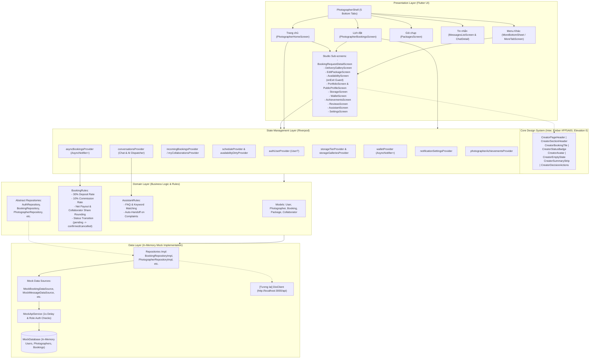

# LENS Creator Mobile — Full Technical Onboarding & Architecture Audit Report

> **Tài liệu bàn giao kỹ thuật & Hướng dẫn gia nhập dự án dành cho Developer mới**  
> **Dự án:** `lens-creator-mobile` (LENS Creator Studio / Photographer Portal)  
> **Thời điểm kiểm tra (Audit Date):** Tháng 10/2026  
> **Tình trạng phân tích:** Đọc và đối soát 100% source code thực tế (166 files Dart, test suite 24/24 passing, analyze 0 issues)  
> **Chế độ kiểm tra:** Read-only audit (không thay đổi code, không refactor, không giả định)

---

## Mục lục

1. [Executive Summary (Dành cho Team Lead & New Developer)](#1-executive-summary)
2. [Project Overview](#2-project-overview)
3. [Tech Stack & Package Audit](#3-tech-stack--package-audit)
4. [Complete Folder & Source Architecture](#4-complete-folder--source-architecture)
5. [Important Files Inventory](#5-important-files-inventory)
6. [Architecture Analysis & Data Flow](#6-architecture-analysis--data-flow)
7. [Routing & Navigation Deep Dive](#7-routing--navigation-deep-dive)
8. [Complete Feature Inventory](#8-complete-feature-inventory)
9. [Feature-by-Feature Deep Dive](#9-feature-by-feature-deep-dive)
10. [Complete Photographer User Flows](#10-complete-photographer-user-flows)
11. [Screen Inventory & Implementation Status](#11-screen-inventory--implementation-status)
12. [Data Layer & API Architecture](#12-data-layer--api-architecture)
13. [Authentication & Authorization System](#13-authentication--authorization-system)
14. [State Management Audit (Riverpod Architecture)](#14-state-management-audit-riverpod-architecture)
15. [UI Architecture & Design System](#15-ui-architecture--design-system)
16. [Reusable Components Catalog](#16-reusable-components-catalog)
17. [Current Implementation Status Matrix](#17-current-implementation-status-matrix)
18. [Mock Data vs Real Data Audit](#18-mock-data-vs-real-data-audit)
19. [Known Issues & Technical Debt](#19-known-issues--technical-debt)
20. [Current Gaps (Missing vs Incomplete Features)](#20-current-gaps)
21. [Developer Entry Guide: Nên bắt đầu đọc từ đâu?](#21-developer-entry-guide)
22. [How To Implement A New Feature (Chuẩn Architecture)](#22-how-to-implement-a-new-feature)
23. [Development Commands Cheatsheet](#23-development-commands-cheatsheet)
24. [Environment & Configuration Audit](#24-environment--configuration-audit)
25. [Testing & Quality Assurance Audit](#25-testing--quality-assurance-audit)
26. [Git & Branch Context](#26-git--branch-context)
27. [Final System Architecture Diagram](#27-final-system-architecture-diagram)

---

## 1. Executive Summary

### 1.1. Current Project State (Dự án đang ở giai đoạn nào?)
`lens-creator-mobile` là ứng dụng di động dành riêng cho **Nhiếp ảnh gia (Photographer / Creator)** trong hệ sinh thái nền tảng dịch vụ nhiếp ảnh **LENS** (thị trường Việt Nam). Source code của app được chuyển giao và đồng bộ nghiệp vụ từ module Photographer Portal trên nền web (`../Lens-web/apps/portal/src/App.tsx`).

Trạng thái hiện tại:
- **UI & Presentation Layer:** Đã hoàn thiện thiết kế chuẩn mobile-native theo design system độc lập (Inter font, màu thương hiệu Ember `#FF5A00`, giao diện phẳng không bóng đổ trang trí, responsive tốt trên cả màn hình nhỏ 320px).
- **Domain & Business Logic:** Toàn bộ business logic trọng tâm (tính cọc 30%, hoa hồng sàn 10%, phân bổ doanh thu theo tỷ lệ liên kết thợ, quy tắc chuyển trạng thái booking, phân chia lịch làm việc theo khung 30 phút, quy tắc trợ lý AI handoff) đã được hiện thực hóa và có test suite tự động kiểm chứng.
- **Data & Networking Layer:** **100% đang chạy trên In-Memory Mock Datastores**. Chưa kết nối HTTP API thật, chưa có Local Persistence (SharedPreferences/SQLite/Keychain). Khi tắt ứng dụng hoặc restart process, mọi dữ liệu cập nhật sẽ quay về bộ dữ liệu mẫu (demo seed).

### 1.2. What Is Already Done (Những gì đã hoàn thiện?)
1. **Toàn bộ khung điều hướng (Navigation Shell):** Bottom navigation 5 tabs (Trang chủ, Lịch đặt, Gói chụp, Tin nhắn, Khác) kết hợp mở rộng qua `MoreBottomSheet` cho 7 tính năng Studio.
2. **Quy trình duyệt & xử lý Booking (Booking Lifecycle):** Lọc theo 4 nhóm trạng thái (Chờ duyệt, Đang diễn ra, Hoàn thành, Đã huỷ), tìm kiếm, lọc thời gian, xác nhận/từ chối lịch đặt, xem chi tiết timeline và phân bổ tài chính.
3. **Liên kết thợ (Collaboration):** Trưởng nhóm mời thợ cộng tác theo tỷ lệ %, thợ phụ nhận lời mời và duyệt/từ chối, tự động tính toán thù lao thực nhận sau khi nghiệm thu.
4. **Bàn giao ảnh buổi chụp (Delivery Gallery):** Theo dõi tiến độ giao ảnh đối chiếu với số lượng cam kết của gói, giao ảnh từ portfolio mẫu, khóa/mở bộ sưu tập theo quota lưu trữ.
5. **Quản lý gói dịch vụ (Package Management):** Thêm, sửa, xóa gói chụp; validate đầy đủ các trường (giá, số lượng ảnh, thời lượng, số ngày giao ảnh); nguyên tắc snapshot gói khi khách đặt.
6. **Lịch làm việc (Schedule & Availability):** Quản lý lịch tuần lặp lại theo khung giờ 30 phút (07:00 - 23:30), đặt ngoại lệ bận theo ngày cụ thể, khóa tự động khung giờ đã có booking; cơ chế cảnh báo chưa lưu (`onExit` navigation guard).
7. **Tin nhắn Studio & Trợ lý AI (Messaging & AI Assistant):** Danh sách hội thoại, chat 1-1, bật/tắt AI per-conversation, bộ quy tắc AI tự động trả lời theo FAQ hoặc tự động handoff về người thật khi có khiếu nại.
8. **Ví tiền & Quản lý thu nhập (Wallet & Payout):** Số dư khả dụng, tiền chờ giải ngân từ các booking đang diễn ra, lịch sử giao dịch và dialog rút tiền theo tỷ lệ (25%, 50%, 100%).
9. **Dung lượng lưu trữ Studio (Storage Tier):** Xem dung lượng đã dùng, thời hạn lưu trữ từng bộ sưu tập, đổi gói cước (Free 2GB, Pro 10GB, Studio 30GB) và mở khóa thư viện quá hạn ngạch.
10. **Hồ sơ năng lực (Portfolio & Public Profile):** Chỉnh sửa bio, kinh nghiệm, bảng giá, phong cách, danh mục tác phẩm; màn hình xem trước công khai (Public Profile) với giao diện khách hàng.
11. **Cài đặt & Thành tựu (Settings & Achievements):** Chỉnh sửa thông tin cá nhân, cài đặt bảo mật 2 lớp, tùy chọn nhận thông báo, xem thứ hạng thợ (Tân binh -> Thợ Kim Cương) và huy hiệu chuyên nghiệp.

### 1.3. What Is In Progress & What Is Missing (Còn thiếu gì?)
- **Thiếu kết nối HTTP API thật:** File [dio_client.dart](file:///Users/dungnguyen/Documents/CODE-PROJECT/LENS/lens-creator-mobile/lib/core/network/dio_client.dart) đã khai báo `dioProvider` với `baseUrl: 'http://localhost:3000/api'` nhưng chưa được gắn vào bất kỳ repository nào.
- **Thiếu Persistent Storage:** Chưa tích hợp thư viện lưu trữ session offline (như `shared_preferences` hay `flutter_secure_storage`).
- **Thiếu Device Photo Picker / Camera:** Chưa có thư viện `image_picker` hay upload multipart/cloud storage. Việc thêm ảnh portfolio hay giao ảnh hiện tại đang dùng URL text input hoặc ảnh mẫu từ mock database.
- **Thiếu Realtime Transport:** Chat hiện đang dùng in-memory state, chưa có WebSocket/SSE/Firebase Messaging để nhận tin nhắn real-time từ khách hàng.

### 1.4. Main Risks (Những rủi ro cần cẩn thận)
- **Tồn tại Code rác / Dead code từ phiên bản cũ:** Màn hình [landing_screen.dart](file:///Users/dungnguyen/Documents/CODE-PROJECT/LENS/lens-creator-mobile/lib/features/landing/landing_screen.dart) và [bookings_list_screen.dart](file:///Users/dungnguyen/Documents/CODE-PROJECT/LENS/lens-creator-mobile/lib/features/shared/bookings_list_screen.dart) là code cũ/khách hàng không còn được định tuyến trong app nhưng vẫn nằm trong source.
- **Dependencies dư thừa trong `pubspec.yaml`:** Các thư viện `lucide_icons_flutter`, `table_calendar`, `cached_network_image`, `flutter_animate`, `riverpod_annotation`, `riverpod_generator`, `build_runner` có mặt trong cấu hình package nhưng không được sử dụng trong luồng nghiệp vụ chính của Creator.

---

## 2. Project Overview

| Thuộc tính | Chi tiết xác định từ Source Code | Ghi chú & Nguồn dẫn |
| :--- | :--- | :--- |
| **Project Name** | `lens_creator_mobile` | [pubspec.yaml:L1](file:///Users/dungnguyen/Documents/CODE-PROJECT/LENS/lens-creator-mobile/pubspec.yaml#L1) |
| **Mục đích ứng dụng** | Studio / Portal di động dành cho Nhiếp ảnh gia trên nền tảng LENS | Quản lý lịch chụp, tài chính, giao ảnh, chat và hồ sơ |
| **Đối tượng sử dụng** | Chỉ dành cho tài khoản có vai trò `photographer` | Guard tại [app_router.dart:L43](file:///Users/dungnguyen/Documents/CODE-PROJECT/LENS/lens-creator-mobile/lib/core/router/app_router.dart#L43) |
| **Vai trò Creator** | Tiếp nhận yêu cầu chụp từ khách, báo giá, khóa lịch, giao ảnh nghiệm thu, cộng tác thợ khác | Net payout sau khi trừ phí sàn 5% - 10% |
| **Công nghệ chính** | Flutter (Dart SDK `^3.13.2`), Riverpod, GoRouter, Dio | Kiến trúc Feature-first kết hợp Clean Architecture nhẹ |
| **Flutter Version** | `Flutter 3.47.2` (Channel stable, Engine revision `1cf1c4773f`) | Kiểm tra qua CLI thực tế trên môi trường máy |
| **Dart Version** | `Dart 3.13.2` (DevTools 2.60.0) | Khớp cấu hình `sdk: ^3.13.2` trong `pubspec.yaml` |
| **Package ID / Bundle** | Android: `vn.awesomic.lens_app`<br>iOS: `vn.awesomic.lensApp` (Display: `Lens App`) | [build.gradle.kts:L8](file:///Users/dungnguyen/Documents/CODE-PROJECT/LENS/lens-creator-mobile/android/app/build.gradle.kts#L8), [Info.plist:L10](file:///Users/dungnguyen/Documents/CODE-PROJECT/LENS/lens-creator-mobile/ios/Runner/Info.plist#L10) |
| **Môi trường & Config** | In-memory Mock Data; `dioProvider` trỏ `http://localhost:3000/api` | Không có file `.env`, chưa cấu hình build flavors |
| **Nền tảng hỗ trợ** | Android (`android/`), iOS (`ios/`), Web (`web/`), macOS, Linux, Windows | Trọng tâm chính hiện tại là iOS và Android |

---

## 3. Tech Stack & Package Audit

Dưới đây là bảng phân tích toàn bộ dependencies thực tế trong [pubspec.yaml](file:///Users/dungnguyen/Documents/CODE-PROJECT/LENS/lens-creator-mobile/pubspec.yaml) và đối soát việc sử dụng trong source code:

| Package | Phiên bản | Mục đích khai báo | Trạng thái sử dụng thực tế | Vị trí sử dụng chính trong Code |
| :--- | :--- | :--- | :--- | :--- |
| **flutter** | SDK | Mobile framework | Hoạt động cốt lõi | Toàn bộ dự án |
| **flutter_riverpod** | `^3.4.3` | State management | Hoạt động cốt lõi | [data_providers.dart](file:///Users/dungnguyen/Documents/CODE-PROJECT/LENS/lens-creator-mobile/lib/providers/data_providers.dart) và các feature notifiers |
| **go_router** | `^18.0.1` | Declarative Routing & Shell | Hoạt động cốt lõi | [app_router.dart](file:///Users/dungnguyen/Documents/CODE-PROJECT/LENS/lens-creator-mobile/lib/core/router/app_router.dart), [photographer_shell.dart](file:///Users/dungnguyen/Documents/CODE-PROJECT/LENS/lens-creator-mobile/lib/core/router/photographer_shell.dart) |
| **intl** | `^0.20.3` | Định dạng tiền tệ, ngày giờ `vi_VN` | Hoạt động cốt lõi | [main.dart:L9](file:///Users/dungnguyen/Documents/CODE-PROJECT/LENS/lens-creator-mobile/lib/main.dart#L9), [studio_booking_card.dart](file:///Users/dungnguyen/Documents/CODE-PROJECT/LENS/lens-creator-mobile/lib/features/photographer/bookings/widgets/studio_booking_card.dart) |
| **google_fonts** | `^8.2.1` | Typography (Font Inter) | Hoạt động cốt lõi | [app_theme.dart:L9](file:///Users/dungnguyen/Documents/CODE-PROJECT/LENS/lens-creator-mobile/lib/core/theme/app_theme.dart#L9) |
| **dio** | `^5.11.1` | HTTP Client | **Chưa sử dụng (Unused)** | Chỉ khởi tạo trong [dio_client.dart](file:///Users/dungnguyen/Documents/CODE-PROJECT/LENS/lens-creator-mobile/lib/core/network/dio_client.dart), chưa gắn vào Repository |
| **flutter_animate** | `^4.5.2` | Hiệu ứng Animation UI | **Code cũ (Dead code)** | Chỉ import trong 3 file không dùng hoặc dead: `landing_screen`, `gallery_grid`, `bookings_list_screen` |
| **table_calendar** | `^3.2.1` | Widget Lịch tháng | **Code cũ (Dead code)** | Chỉ import trong [calendar_view.dart](file:///Users/dungnguyen/Documents/CODE-PROJECT/LENS/lens-creator-mobile/lib/features/photographer/availability/widgets/calendar_view.dart) (không được gọi) |
| **cached_network_image** | `^4.0.2` | Cache hình ảnh mạng | **Code cũ (Dead code)** | Chỉ import trong [gallery_grid.dart](file:///Users/dungnguyen/Documents/CODE-PROJECT/LENS/lens-creator-mobile/lib/features/photographer/portfolio/widgets/gallery_grid.dart) (không được gọi) |
| **lucide_icons_flutter** | `^3.1.20` | Bộ icon Lucide | **Không sử dụng (Unused)** | 0 file import trong toàn bộ `lib/` (toàn app dùng `Icons.*` Material) |
| **riverpod_annotation** | `^4.0.7` | Code generator cho Riverpod | **Không sử dụng (Unused)** | Dự án viết Riverpod thủ công (`Notifier`, `AsyncNotifier`), không sinh code |
| **build_runner** | `^2.16.1` | Tool sinh code Dart | **Không sử dụng (Unused)** | Không có file `.g.dart` nào tồn tại trong `lib/` |
| **riverpod_generator** | `^4.0.9` | Tool sinh provider Riverpod | **Không sử dụng (Unused)** | Không sử dụng |
| **flutter_lints** | `^6.0.0` | Bộ lint quy tắc code | Hoạt động tốt | `flutter analyze` đạt 0 issues |
| **flutter_test** | SDK | Unit & Widget testing | Hoạt động tốt | 3 file test, 24 test cases passing |

---

## 4. Complete Folder & Source Architecture

### 4.1. Directory Tree Tổng quan
```text
lens-creator-mobile/
├── android/                             # Android native host project (Kotlin DSL, Java 17)
├── ios/                                 # iOS native host project (Xcode Workspace, Swift)
├── web/, linux/, macos/, windows/       # Các nền tảng phụ trợ của Flutter
├── docs/
│   └── creator_mobile_design_system.md  # Tài liệu quy chuẩn thiết kế UI của Creator Mobile
├── CREATOR_MIGRATION.md                 # Bảng đối chiếu nghiệp vụ chuyển đổi từ Web Portal
├── pubspec.yaml                         # Cấu hình dự án & dependencies
├── test/                                # Bộ test kiểm thử tự động (Unit & Widget tests)
│   ├── creator_flow_test.dart           # Test luồng nghiệp vụ cốt lõi (24 assertions)
│   ├── assistant_screen_test.dart       # Test responsive màn hình Trợ lý AI (320px)
│   └── settings_screen_test.dart        # Test các tab cài đặt và tương tác UI
└── lib/                                 # 166 file source code Dart của ứng dụng
    ├── main.dart                        # Điểm khởi chạy ứng dụng (Entry point)
    ├── core/                            # Thành phần dùng chung toàn hệ thống
    │   ├── network/                     # Cấu hình HTTP Client (Dio)
    │   ├── router/                      # Cấu hình GoRouter và ShellRoute Bottom Navigation
    │   ├── theme/                       # Hệ thống màu sắc, tokens, font Inter, ThemeData
    │   └── widgets/                     # Bộ UI Component chuẩn (Design System Reusable Widgets)
    ├── domain/                          # Lớp nghiệp vụ độc lập (Enterprise Business Rules)
    │   ├── models/                      # Các Data Model cốt lõi (User, Photographer, Booking, v.v.)
    │   ├── repositories/                # Hợp đồng giao tiếp dữ liệu (Abstract Interfaces)
    │   └── booking_rules.dart           # Quy tắc nghiệp vụ tính cọc, hoa hồng, trạng thái
    ├── data/                            # Lớp hiện thực dữ liệu (Data Implementation Layer)
    │   ├── datasources/mock/            # Mock Data Source cung cấp dữ liệu giả lập có độ trễ
    │   ├── repositories/                # Hiện thực các Repository interface từ Domain
    │   ├── mock_database.dart           # Cơ sở dữ liệu in-memory lưu trữ User, Photographer, Booking
    │   └── mock_api_service.dart        # Service mô phỏng backend API với độ trễ 1 giây
    ├── providers/
    │   └── data_providers.dart          # Riverpod Provider trung tâm quản lý State toàn cục
    └── features/                        # Kiến trúc Feature-first chia theo chức năng
        ├── auth/                        # Xác thực, đăng nhập & đăng ký Nhiếp ảnh gia
        ├── splash/                      # Màn hình khởi động kiểm tra phiên đăng nhập
        ├── landing/                     # [Cũ/Dead code] Màn hình giới thiệu khách hàng & UI Gallery
        ├── shared/                      # [Cũ/Dead code] Màn hình booking list cũ
        └── photographer/                # Toàn bộ tính năng dành riêng cho Nhiếp ảnh gia
            ├── photographer_home_screen.dart       # Màn hình Trang chủ Studio
            ├── photographer_bookings_screen.dart   # Màn hình Danh sách & Quản lý Lịch đặt
            ├── booking_request_detail_screen.dart  # Màn hình Chi tiết yêu cầu chụp
            ├── home/widgets/            # Component phụ trợ cho Trang chủ
            ├── bookings/                # Giao ảnh, tabs lọc, duyệt booking, liên kết thợ
            ├── packages/                # Danh sách & Form thêm/sửa Gói dịch vụ
            ├── messages/                # Danh sách hội thoại, chat 1-1, kiểm soát trợ lý AI
            ├── availability/            # Quản lý Lịch làm việc tuần & ngày ngoại lệ
            ├── portfolio/               # Hồ sơ năng lực & Màn hình xem trước công khai
            ├── wallet/                  # Ví thu nhập, lịch sử giao dịch & rút tiền
            ├── storage/                 # Quản lý dung lượng lưu trữ & mở khóa bộ ảnh
            ├── achievements/            # Thứ hạng thợ, huy hiệu, chỉ số hoạt động
            ├── reviews/                 # Đánh giá & nhận xét từ khách hàng
            ├── assistant/               # Cấu hình Trợ lý AI trả lời tự động & FAQ
            ├── settings/                # Thông tin cá nhân, bảo mật 2 lớp, thông báo
            └── widgets/                 # App bar Studio và Bottom sheet "Khác"
```

### 4.2. Chi tiết từng Folder chức năng

#### `lib/core/`
- [dio_client.dart](file:///Users/dungnguyen/Documents/CODE-PROJECT/LENS/lens-creator-mobile/lib/core/network/dio_client.dart): Định nghĩa `dioProvider` với `BaseOptions` (timeout 10s, base URL placeholder). Hiện là placeholder cho giai đoạn tích hợp backend.
- [app_router.dart](file:///Users/dungnguyen/Documents/CODE-PROJECT/LENS/lens-creator-mobile/lib/core/router/app_router.dart): Cấu hình router trung tâm với GoRouter. Xử lý redirect guard dựa trên trạng thái `authUserProvider` và `user.role`.
- [photographer_shell.dart](file:///Users/dungnguyen/Documents/CODE-PROJECT/LENS/lens-creator-mobile/lib/core/router/photographer_shell.dart): Vỏ bọc giao diện chứa thanh `NavigationBar` 5 nút chuẩn mobile-native.
- [app_colors.dart](file:///Users/dungnguyen/Documents/CODE-PROJECT/LENS/lens-creator-mobile/lib/core/theme/app_colors.dart), [app_tokens.dart](file:///Users/dungnguyen/Documents/CODE-PROJECT/LENS/lens-creator-mobile/lib/core/theme/app_tokens.dart), [app_theme.dart](file:///Users/dungnguyen/Documents/CODE-PROJECT/LENS/lens-creator-mobile/lib/core/theme/app_theme.dart): Hệ thống design tokens, khoảng cách 4-point scale, typography Inter và cấu hình `ThemeData`.
- `lib/core/widgets/`: Chứa 13 component thuộc bộ nhận diện Creator Design System mới (`CreatorBookingTile`, `CreatorAvatar`, `CreatorPageHeader`, v.v.) và các component nút bấm cơ bản.

#### `lib/domain/`
- [models.dart](file:///Users/dungnguyen/Documents/CODE-PROJECT/LENS/lens-creator-mobile/lib/domain/models/models.dart): Khai báo các thực thể cốt lõi: `User`, `Photographer`, `PhotographerPackage`, `Booking`, `BookingStatus`, `BookingCollaborator`, `CollaborationStatus`.
- [booking_rules.dart](file:///Users/dungnguyen/Documents/CODE-PROJECT/LENS/lens-creator-mobile/lib/domain/booking_rules.dart): Chứa business logic tinh khiết: tỷ lệ đặt cọc 30% (`depositRate`), tỷ lệ hoa hồng 10% (`commissionRate`), công thức làm tròn thù lao net payout, phân chia tiền cho thợ liên kết (`payoutFor`), kiểm tra điều kiện chuyển trạng thái (`canTransition`) và nhãn hiển thị trạng thái tiếng Việt.
- `lib/domain/repositories/`: Chứa các interface trừu tượng (`AuthRepository`, `BookingRepository`, `PhotographerRepository`).

#### `lib/data/`
- [mock_database.dart](file:///Users/dungnguyen/Documents/CODE-PROJECT/LENS/lens-creator-mobile/lib/data/mock_database.dart): Nơi lưu trữ in-memory state của toàn bộ user mẫu, 5 nhiếp ảnh gia và 8 đơn booking đại diện cho đủ mọi trạng thái vòng đời.
- [mock_api_service.dart](file:///Users/dungnguyen/Documents/CODE-PROJECT/LENS/lens-creator-mobile/lib/data/mock_api_service.dart): Giả lập REST API với `Future.delayed(Duration(seconds: 1))` kèm validation quyền hạn nghiêm ngặt (chỉ thợ sở hữu booking mới được duyệt hoặc giao ảnh).
- `lib/data/datasources/mock/`: Các datasource giả lập cho từng tính năng (`mock_booking_data_source`, `mock_message_data_source`, `mock_assistant_data_source`, v.v.).
- `lib/data/repositories/`: Lớp hiện thực repository gọi datasource tương ứng.

#### `lib/features/photographer/`
Từng folder con đại diện cho một domain nghiệp vụ cụ thể của Creator Studio, bao gồm screen, widgets riêng, state provider và repository cục bộ nếu có.

---

## 5. Important Files Inventory

Dưới đây là danh sách các file có vai trò quyết định cấu trúc và hoạt động của toàn bộ project:

| File Path | Vai trò & Mục đích | Thành phần phụ thuộc / Sử dụng bởi | Mức độ quan trọng |
| :--- | :--- | :--- | :--- |
| [lib/main.dart](file:///Users/dungnguyen/Documents/CODE-PROJECT/LENS/lens-creator-mobile/lib/main.dart) | Entry point của app; khởi tạo `intl` locale `vi_VN`, bọc `ProviderScope`, gắn `AppTheme` | Toàn bộ ứng dụng | **Critical** |
| [lib/core/router/app_router.dart](file:///Users/dungnguyen/Documents/CODE-PROJECT/LENS/lens-creator-mobile/lib/core/router/app_router.dart) | Định nghĩa route tree, URL paths, dynamic params, redirect logic & auth guards | `MyApp`, toàn bộ luồng điều hướng | **Critical** |
| [lib/core/router/photographer_shell.dart](file:///Users/dungnguyen/Documents/CODE-PROJECT/LENS/lens-creator-mobile/lib/core/router/photographer_shell.dart) | Bottom Navigation Bar chính với 5 destination và logic điều hướng tab | `app_router.dart` | **Critical** |
| [lib/providers/data_providers.dart](file:///Users/dungnguyen/Documents/CODE-PROJECT/LENS/lens-creator-mobile/lib/providers/data_providers.dart) | Quản lý state toàn cục: `authUserProvider`, `photographersProvider`, `asyncBookingsProvider`, `myCollaborationsProvider` | Toàn bộ các screen và widget của Creator | **Critical** |
| [lib/domain/booking_rules.dart](file:///Users/dungnguyen/Documents/CODE-PROJECT/LENS/lens-creator-mobile/lib/domain/booking_rules.dart) | Single source of truth về quy tắc tài chính, đặt cọc, hoa hồng, trạng thái booking | Màn hình Home, Bookings, Detail, Delivery, Test | **Critical** |
| [lib/domain/models/models.dart](file:///Users/dungnguyen/Documents/CODE-PROJECT/LENS/lens-creator-mobile/lib/domain/models/models.dart) | Định nghĩa cấu trúc Data Model nền tảng: User, Photographer, Booking, Collaborator | Toàn bộ app | **Critical** |
| [lib/data/mock_database.dart](file:///Users/dungnguyen/Documents/CODE-PROJECT/LENS/lens-creator-mobile/lib/data/mock_database.dart) | Kho dữ liệu in-memory mẫu cho phiên làm việc hiện tại | Repositories, Notifiers, Test suite | **High** |
| [lib/data/mock_api_service.dart](file:///Users/dungnguyen/Documents/CODE-PROJECT/LENS/lens-creator-mobile/lib/data/mock_api_service.dart) | Mô phỏng Network call, delay, và business authorization checks | `MockBookingDataSource` | **High** |
| [lib/core/theme/app_theme.dart](file:///Users/dungnguyen/Documents/CODE-PROJECT/LENS/lens-creator-mobile/lib/core/theme/app_theme.dart) | Hệ thống ThemeData Material 3, font Inter, màu sắc nút bấm và input | `MaterialApp` | **High** |
| [lib/core/widgets/creator_booking_tile.dart](file:///Users/dungnguyen/Documents/CODE-PROJECT/LENS/lens-creator-mobile/lib/core/widgets/creator_booking_tile.dart) | UI thẻ tóm tắt đơn booking chuẩn dùng chung trên Home, Bookings, Search | Các booking cards của studio | **Medium** |
| [lib/features/photographer/availability/schedule_provider.dart](file:///Users/dungnguyen/Documents/CODE-PROJECT/LENS/lens-creator-mobile/lib/features/photographer/availability/schedule_provider.dart) | Quản lý state lịch làm việc và cờ dirty thoát trang | `AvailabilityScreen`, `app_router.dart` | **Medium** |
| [lib/features/photographer/messages/conversation_provider.dart](file:///Users/dungnguyen/Documents/CODE-PROJECT/LENS/lens-creator-mobile/lib/features/photographer/messages/conversation_provider.dart) | Quản lý hội thoại chat, gửi tin, đánh dấu đã đọc và kích hoạt phản hồi tự động của AI | `MessagesListScreen`, `ChatDetailScreen` | **Medium** |

---

## 6. Architecture Analysis & Data Flow

### 6.1. Mô hình kiến trúc thực tế
Dự án áp dụng mô hình lai giữa **Feature-First Organization** và **Clean Architecture (Lightweight)**:

```text
┌─────────────────────────────────────────────────────────────┐
│                      PRESENTATION LAYER                     │
│  Screens (UI) ◄──► Reusable Widgets (Creator Design System) │
└──────────────────────────────┬──────────────────────────────┘
                               │ watches / calls
                               ▼
┌─────────────────────────────────────────────────────────────┐
│                    STATE MANAGEMENT LAYER                   │
│  Riverpod Notifiers (AsyncBookingsNotifier, AuthUserNotifier│
│  ScheduleNotifier, ConversationsNotifier, StorageNotifier)  │
└──────────────────────────────┬──────────────────────────────┘
                               │ reads
                               ▼
┌─────────────────────────────────────────────────────────────┐
│                         DOMAIN LAYER                        │
│  - Models (User, Booking, Photographer, WorkSchedule)       │
│  - Business Rules (BookingRules, AssistantRules)            │
│  - Repository Interfaces (AuthRepository, BookingRepository)│
└──────────────────────────────┬──────────────────────────────┘
                               │ implements
                               ▼
┌─────────────────────────────────────────────────────────────┐
│                          DATA LAYER                         │
│  - Repository Impl (BookingRepositoryImpl, etc.)            │
│  - Mock Data Sources (MockBookingDataSource, etc.)          │
│  - In-Memory Mock Database & Mock Api Service               │
│  - [Future] Dio Client & REST API Backend                   │
└─────────────────────────────────────────────────────────────┘
```

### 6.2. Luồng dữ liệu thực tế (Trace một tác vụ cụ thể: Duyệt lịch đặt chụp)
Dưới đây là luồng dữ liệu khi Nhiếp ảnh gia nhấn nút **"Chấp nhận"** một yêu cầu chụp từ màn hình Home hoặc Chi tiết lịch đặt:

```text
1. User nhấn "Chấp nhận" trên UI (HomeBookingCard hoặc BookingRequestDetailScreen)
   │
   ▼
2. Gọi Notifier qua Riverpod:
   ref.read(asyncBookingsProvider.notifier).updateBookingStatus(bookingId, BookingStatus.confirmed)
   │
   ▼
3. AsyncBookingsNotifier ([data_providers.dart:L112])
   - Giữ trạng thái cũ (previousState)
   - Gọi BookingRepository: ref.read(bookingRepositoryProvider).updateBookingStatus(...)
   │
   ▼
4. BookingRepositoryImpl ([booking_repository_impl.dart:L20])
   - Chuyển tiếp tới MockBookingDataSource.updateBookingStatus(...)
   │
   ▼
5. MockBookingDataSource ([mock_booking_data_source.dart:L11])
   - Chuyển tiếp tới mockApiService.updateBookingStatus(...)
   │
   ▼
6. MockApiService ([mock_api_service.dart:L59])
   - Delay mô phỏng mạng 1000ms
   - Kiểm tra quyền: actor.id == booking.photographerId && actor.role == 'photographer'
   - Kiểm tra nghiệp vụ qua Domain Rule: BookingRules.canTransition(booking.status, newStatus)
   - Cập nhật bản ghi trong MockDatabase.bookings
   │
   ▼
7. Phản hồi thành công quay ngược về AsyncBookingsNotifier
   - Optimistic/immutable update: cập nhật state = AsyncData(updatedList)
   │
   ▼
8. UI tự động Re-render
   - Các Provider phụ thuộc (`incomingBookingsProvider`, `myBookingsProvider`) cập nhật
   - Đơn chụp tự động chuyển từ tab "Chờ duyệt" sang tab "Đang diễn ra"
   - SnackBar hiển thị thông báo thành công cho người dùng
```

---

## 7. Routing & Navigation Deep Dive

### 7.1. Route Tree hoàn chỉnh
Dự án sử dụng GoRouter cấu hình tại [lib/core/router/app_router.dart](file:///Users/dungnguyen/Documents/CODE-PROJECT/LENS/lens-creator-mobile/lib/core/router/app_router.dart). Toàn bộ route tree như sau:

```text
GoRouter (initialLocation: '/')
├── /                                   -> SplashScreen
├── /login                              -> LoginScreen (Hỗ trợ query param ?from=... và ?reason=...)
├── /gallery                            -> UiGalleryScreen (Trưng bày design system cũ)
│
└── ShellRoute (PhotographerShell - Bottom Navigation Bar 5 Tabs)
    ├── /photographer_home              -> PhotographerHomeScreen (Tab 0: Trang chủ)
    ├── /photographer_home/bookings     -> PhotographerBookingsScreen (Tab 1: Lịch đặt)
    │   ├── /booking/:id                -> BookingRequestDetailScreen (Chi tiết lịch đặt)
    │   └── /booking/:id/gallery        -> DeliveryGalleryScreen (Giao & xem ảnh bộ sưu tập)
    │
    ├── /photographer_home/packages     -> PackagesScreen (Tab 2: Gói chụp)
    │   └── /edit/:id                   -> EditPackageScreen (Thêm mới id='new' hoặc sửa id cụ thể)
    │
    ├── /photographer_home/messages     -> MessagesListScreen (Tab 3: Tin nhắn)
    │   └── /:id                        -> ChatDetailScreen (Chat 1-1 với khách/thợ & bật/tắt AI)
    │
    └── [Tab 4: 'Khác' - Mở MoreBottomSheet với 7 đường dẫn Studio]
        ├── /photographer_home/more             -> MoreTabScreen (Dạng màn hình độc lập)
        ├── /photographer_home/availability     -> AvailabilityScreen (Có onExit dirty guard)
        ├── /photographer_home/portfolio        -> PortfolioScreen (Xem & sửa profile/tác phẩm)
        ├── /photographer_home/public_profile   -> PublicProfileScreen (Xem trước hồ sơ công khai)
        ├── /photographer_home/storage          -> StorageScreen (Quản lý dung lượng & gói lưu trữ)
        ├── /photographer_home/achievements     -> AchievementsScreen (Cấp bậc thợ & huy hiệu)
        ├── /photographer_home/wallet           -> WalletScreen (Số dư ví & yêu cầu rút tiền)
        ├── /photographer_home/reviews          -> ReviewsScreen (Xem đánh giá từ khách hàng)
        ├── /photographer_home/assistant        -> AssistantScreen (Thiết lập kịch bản Trợ lý AI)
        └── /photographer_home/settings         -> SettingsScreen (Hồ sơ, mật khẩu, thông báo)
```

### 7.2. Bảng kê chi tiết từng Route

| Route Path | Screen Class | File nguồn | Entry Point | Parameters | Guard & Điều kiện bảo vệ | Trạng thái |
| :--- | :--- | :--- | :--- | :--- | :--- | :--- |
| `/` | `SplashScreen` | [splash_screen.dart](file:///Users/dungnguyen/Documents/CODE-PROJECT/LENS/lens-creator-mobile/lib/features/splash/splash_screen.dart) | Khởi động app | Không | Chuyển tiếp sau 500ms dựa vào `authUser` | Complete |
| `/login` | `LoginScreen` | [login_screen.dart](file:///Users/dungnguyen/Documents/CODE-PROJECT/LENS/lens-creator-mobile/lib/features/auth/login_screen.dart) | Splash / Logout / Guard | `from`, `reason` | Nếu đã đăng nhập role photographer -> redirect `/photographer_home` | Complete |
| `/gallery` | `UiGalleryScreen` | [ui_gallery_screen.dart](file:///Users/dungnguyen/Documents/CODE-PROJECT/LENS/lens-creator-mobile/lib/features/landing/ui_gallery_screen.dart) | Dev direct route | Không | Public | UI Only |
| `/photographer_home` | `PhotographerHomeScreen` | [photographer_home_screen.dart](file:///Users/dungnguyen/Documents/CODE-PROJECT/LENS/lens-creator-mobile/lib/features/photographer/photographer_home_screen.dart) | Bottom Tab 0 | Không | Bắt buộc login role `photographer` | Complete (Mock) |
| `.../bookings` | `PhotographerBookingsScreen` | [photographer_bookings_screen.dart](file:///Users/dungnguyen/Documents/CODE-PROJECT/LENS/lens-creator-mobile/lib/features/photographer/photographer_bookings_screen.dart) | Bottom Tab 1 | Không | Bắt buộc login role `photographer` | Complete (Mock) |
| `.../booking/:id` | `BookingRequestDetailScreen` | [booking_request_detail_screen.dart](file:///Users/dungnguyen/Documents/CODE-PROJECT/LENS/lens-creator-mobile/lib/features/photographer/booking_request_detail_screen.dart) | Card click từ Home / Bookings | Path: `id` | Bắt buộc login role `photographer` | Complete (Mock) |
| `.../booking/:id/gallery` | `DeliveryGalleryScreen` | [delivery_gallery_screen.dart](file:///Users/dungnguyen/Documents/CODE-PROJECT/LENS/lens-creator-mobile/lib/features/photographer/bookings/delivery_gallery_screen.dart) | Nút "Giao ảnh" trên Detail / Storage | Path: `id` | Bắt buộc login role `photographer` | Complete (Mock) |
| `.../packages` | `PackagesScreen` | [packages_screen.dart](file:///Users/dungnguyen/Documents/CODE-PROJECT/LENS/lens-creator-mobile/lib/features/photographer/packages/packages_screen.dart) | Bottom Tab 2 | Không | Bắt buộc login role `photographer` | Complete (Mock) |
| `.../packages/edit/:id` | `EditPackageScreen` | [edit_package_screen.dart](file:///Users/dungnguyen/Documents/CODE-PROJECT/LENS/lens-creator-mobile/lib/features/photographer/packages/edit_package_screen.dart) | Nút "Thêm gói" hoặc click Package | Path: `id` (`'new'` hoặc ID) | Bắt buộc login role `photographer` | Complete (Mock) |
| `.../messages` | `MessagesListScreen` | [messages_list_screen.dart](file:///Users/dungnguyen/Documents/CODE-PROJECT/LENS/lens-creator-mobile/lib/features/photographer/messages/messages_list_screen.dart) | Bottom Tab 3 | Không | Bắt buộc login role `photographer` | Complete (Mock) |
| `.../messages/:id` | `ChatDetailScreen` | [chat_detail_screen.dart](file:///Users/dungnguyen/Documents/CODE-PROJECT/LENS/lens-creator-mobile/lib/features/photographer/messages/chat_detail_screen.dart) | Click conversation / Nút "Nhắn tin" | Path: `id` | Bắt buộc login role `photographer` | Complete (Mock) |
| `.../more` | `MoreTabScreen` | [more_tab_screen.dart](file:///Users/dungnguyen/Documents/CODE-PROJECT/LENS/lens-creator-mobile/lib/features/shared/more_tab_screen.dart) | Direct link / Fallback Tab 4 | Không | Bắt buộc login role `photographer` | Complete (Mock) |
| `.../availability` | `AvailabilityScreen` | [availability_screen.dart](file:///Users/dungnguyen/Documents/CODE-PROJECT/LENS/lens-creator-mobile/lib/features/photographer/availability/availability_screen.dart) | More sheet / Home banner / AppBar | Không | Có `onExit` guard cảnh báo bỏ thay đổi | Complete (Mock) |
| `.../portfolio` | `PortfolioScreen` | [portfolio_screen.dart](file:///Users/dungnguyen/Documents/CODE-PROJECT/LENS/lens-creator-mobile/lib/features/photographer/portfolio/portfolio_screen.dart) | More sheet / Home menu | Không | Bắt buộc login role `photographer` | Complete (Mock) |
| `.../public_profile` | `PublicProfileScreen` | [public_profile_screen.dart](file:///Users/dungnguyen/Documents/CODE-PROJECT/LENS/lens-creator-mobile/lib/features/photographer/portfolio/public_profile_screen.dart) | Nút xem trước từ Portfolio | Không | Bắt buộc login role `photographer` | Complete (Mock) |
| `.../wallet` | `WalletScreen` | [wallet_screen.dart](file:///Users/dungnguyen/Documents/CODE-PROJECT/LENS/lens-creator-mobile/lib/features/photographer/wallet/wallet_screen.dart) | More sheet / Home shortcut | Không | Bắt buộc login role `photographer` | Complete (Mock) |
| `.../storage` | `StorageScreen` | [storage_screen.dart](file:///Users/dungnguyen/Documents/CODE-PROJECT/LENS/lens-creator-mobile/lib/features/photographer/storage/storage_screen.dart) | More sheet / Delivery link | Không | Bắt buộc login role `photographer` | Complete (Mock) |
| `.../achievements` | `AchievementsScreen` | [achievements_screen.dart](file:///Users/dungnguyen/Documents/CODE-PROJECT/LENS/lens-creator-mobile/lib/features/photographer/achievements/achievements_screen.dart) | More sheet | Không | Bắt buộc login role `photographer` | Complete (Mock) |
| `.../reviews` | `ReviewsScreen` | [reviews_screen.dart](file:///Users/dungnguyen/Documents/CODE-PROJECT/LENS/lens-creator-mobile/lib/features/photographer/reviews/reviews_screen.dart) | More sheet / Profile rating click | Không | Bắt buộc login role `photographer` | Complete (Mock) |
| `.../assistant` | `AssistantScreen` | [assistant_screen.dart](file:///Users/dungnguyen/Documents/CODE-PROJECT/LENS/lens-creator-mobile/lib/features/photographer/assistant/assistant_screen.dart) | More sheet | Không | Bắt buộc login role `photographer` | Complete (Mock) |
| `.../settings` | `SettingsScreen` | [settings_screen.dart](file:///Users/dungnguyen/Documents/CODE-PROJECT/LENS/lens-creator-mobile/lib/features/photographer/settings/settings_screen.dart) | More sheet / Avatar trên AppBar | Không | Bắt buộc login role `photographer` | Complete (Mock) |

---

## 8. Complete Feature Inventory

Bảng kiểm kê 12 tính năng nghiệp vụ của ứng dụng:

| Feature | Trạng thái | Màn hình chính | File nguồn cốt lõi | Ghi chú & Đánh giá |
| :--- | :--- | :--- | :--- | :--- |
| **1. Authentication** | Hoàn chỉnh (Mock) | `LoginScreen` | [login_screen.dart](file:///Users/dungnguyen/Documents/CODE-PROJECT/LENS/lens-creator-mobile/lib/features/auth/login_screen.dart), [mock_auth_repository.dart](file:///Users/dungnguyen/Documents/CODE-PROJECT/LENS/lens-creator-mobile/lib/features/auth/data/mock_auth_repository.dart) | Hỗ trợ đăng nhập, đăng ký tài khoản thợ mới, validation đầy đủ, nút điền tài khoản mẫu |
| **2. Studio Dashboard** | Hoàn chỉnh (Mock) | `PhotographerHomeScreen` | [photographer_home_screen.dart](file:///Users/dungnguyen/Documents/CODE-PROJECT/LENS/lens-creator-mobile/lib/features/photographer/photographer_home_screen.dart) | Banner động theo công việc, danh sách cần duyệt, buổi chụp sắp tới, summary strip 4 chỉ số |
| **3. Booking Management** | Hoàn chỉnh (Mock) | `PhotographerBookingsScreen`, `BookingRequestDetailScreen` | [photographer_bookings_screen.dart](file:///Users/dungnguyen/Documents/CODE-PROJECT/LENS/lens-creator-mobile/lib/features/photographer/photographer_bookings_screen.dart), [booking_rules.dart](file:///Users/dungnguyen/Documents/CODE-PROJECT/LENS/lens-creator-mobile/lib/domain/booking_rules.dart) | Lọc 4 nhóm trạng thái, search, lọc ngày, xác nhận/từ chối cọc, xem chi tiết và timeline thanh toán |
| **4. Collaborator Sharing** | Hoàn chỉnh (Mock) | Widgets trên Bookings & Booking Detail | [collaborators_panel.dart](file:///Users/dungnguyen/Documents/CODE-PROJECT/LENS/lens-creator-mobile/lib/features/photographer/bookings/widgets/collaborators_panel.dart), [collaboration_invites.dart](file:///Users/dungnguyen/Documents/CODE-PROJECT/LENS/lens-creator-mobile/lib/features/photographer/bookings/widgets/collaboration_invites.dart) | Mời thợ khác cùng chụp theo tỷ lệ %, nhận & duyệt lời mời, tự động tính thù lao thực nhận |
| **5. Photo Delivery** | Hoàn chỉnh (Mock) | `DeliveryGalleryScreen` | [delivery_gallery_screen.dart](file:///Users/dungnguyen/Documents/CODE-PROJECT/LENS/lens-creator-mobile/lib/features/photographer/bookings/delivery_gallery_screen.dart) | Giao tối đa 5 ảnh/lần từ portfolio mẫu, thanh tiến độ cam kết theo gói, blur ảnh khi gallery bị khóa |
| **6. Package Management** | Hoàn chỉnh (Mock) | `PackagesScreen`, `EditPackageScreen` | [packages_screen.dart](file:///Users/dungnguyen/Documents/CODE-PROJECT/LENS/lens-creator-mobile/lib/features/photographer/packages/packages_screen.dart), [edit_package_screen.dart](file:///Users/dungnguyen/Documents/CODE-PROJECT/LENS/lens-creator-mobile/lib/features/photographer/packages/edit_package_screen.dart) | CRUD gói dịch vụ, validate giá, số ảnh, thời lượng, số ngày giao; ràng buộc tối thiểu 1 gói |
| **7. Work Availability** | Hoàn chỉnh (Mock) | `AvailabilityScreen` | [availability_screen.dart](file:///Users/dungnguyen/Documents/CODE-PROJECT/LENS/lens-creator-mobile/lib/features/photographer/availability/availability_screen.dart), [work_schedule.dart](file:///Users/dungnguyen/Documents/CODE-PROJECT/LENS/lens-creator-mobile/lib/features/photographer/availability/work_schedule.dart) | Quản lý khung 30 phút hàng tuần, khóa lịch có booking, đặt ngày bận ngoại lệ, guard chưa lưu |
| **8. Studio Messaging** | Hoàn chỉnh (Mock) | `MessagesListScreen`, `ChatDetailScreen` | [messages_list_screen.dart](file:///Users/dungnguyen/Documents/CODE-PROJECT/LENS/lens-creator-mobile/lib/features/photographer/messages/messages_list_screen.dart), [chat_detail_screen.dart](file:///Users/dungnguyen/Documents/CODE-PROJECT/LENS/lens-creator-mobile/lib/features/photographer/messages/chat_detail_screen.dart) | Hộp thư đến, lọc chưa đọc, tìm kiếm, chat 1-1, mở chat trực tiếp từ đơn booking |
| **9. AI Assistant Setup** | Hoàn chỉnh (Mock) | `AssistantScreen`, Chat AI Toggle | [assistant_screen.dart](file:///Users/dungnguyen/Documents/CODE-PROJECT/LENS/lens-creator-mobile/lib/features/photographer/assistant/assistant_screen.dart), [assistant_rules.dart](file:///Users/dungnguyen/Documents/CODE-PROJECT/LENS/lens-creator-mobile/lib/features/photographer/assistant/assistant_rules.dart) | Cấu hình phong cách, khu vực, tone giọng, FAQ; tự động trả lời hoặc handoff khi khách phàn nàn |
| **10. Studio Storage** | Hoàn chỉnh (Mock) | `StorageScreen` | [storage_screen.dart](file:///Users/dungnguyen/Documents/CODE-PROJECT/LENS/lens-creator-mobile/lib/features/photographer/storage/storage_screen.dart), [storage_provider.dart](file:///Users/dungnguyen/Documents/CODE-PROJECT/LENS/lens-creator-mobile/lib/features/photographer/storage/storage_provider.dart) | Giám sát dung lượng từng bộ ảnh, đếm ngược ngày hết hạn, đổi gói Free/Pro/Studio để mở khóa ảnh |
| **11. Studio Wallet** | Hoàn chỉnh (Mock) | `WalletScreen` | [wallet_screen.dart](file:///Users/dungnguyen/Documents/CODE-PROJECT/LENS/lens-creator-mobile/lib/features/photographer/wallet/wallet_screen.dart), [mock_wallet_repository.dart](file:///Users/dungnguyen/Documents/CODE-PROJECT/LENS/lens-creator-mobile/lib/features/photographer/wallet/mock_wallet_repository.dart) | Số dư khả dụng, tiền chờ sàn giải ngân, lịch sử biến động số dư, dialog rút tiền về ngân hàng |
| **12. Portfolio & Profile** | Hoàn chỉnh (Mock) | `PortfolioScreen`, `PublicProfileScreen` | [portfolio_screen.dart](file:///Users/dungnguyen/Documents/CODE-PROJECT/LENS/lens-creator-mobile/lib/features/photographer/portfolio/portfolio_screen.dart), [public_profile_screen.dart](file:///Users/dungnguyen/Documents/CODE-PROJECT/LENS/lens-creator-mobile/lib/features/photographer/portfolio/public_profile_screen.dart) | Sửa tiểu sử, kinh nghiệm, thêm URL ảnh tác phẩm; chế độ xem trước trang công khai của thợ |
| **13. Rank & Badges** | Hoàn chỉnh (Mock) | `AchievementsScreen` | [achievements_screen.dart](file:///Users/dungnguyen/Documents/CODE-PROJECT/LENS/lens-creator-mobile/lib/features/photographer/achievements/achievements_screen.dart), [photographer_rank.dart](file:///Users/dungnguyen/Documents/CODE-PROJECT/LENS/lens-creator-mobile/lib/features/photographer/achievements/models/photographer_rank.dart) | 5 cấp bậc thợ tương ứng mức giảm phí sàn từ 10% xuống 5%, huy hiệu nghiệp vụ |
| **14. Customer Reviews** | Hoàn chỉnh (Mock) | `ReviewsScreen` | [reviews_screen.dart](file:///Users/dungnguyen/Documents/CODE-PROJECT/LENS/lens-creator-mobile/lib/features/photographer/reviews/reviews_screen.dart), [review_provider.dart](file:///Users/dungnguyen/Documents/CODE-PROJECT/LENS/lens-creator-mobile/lib/features/photographer/reviews/review_provider.dart) | Điểm đánh giá trung bình, số lượng review, danh sách nhận xét có phân trang ngày tháng |
| **15. Settings & Security** | Hoàn chỉnh (Mock) | `SettingsScreen` | [settings_screen.dart](file:///Users/dungnguyen/Documents/CODE-PROJECT/LENS/lens-creator-mobile/lib/features/photographer/settings/settings_screen.dart), [settings_provider.dart](file:///Users/dungnguyen/Documents/CODE-PROJECT/LENS/lens-creator-mobile/lib/features/photographer/settings/settings_provider.dart) | 3 tab: Thông tin cá nhân, Tài khoản & Bảo mật (đổi mật khẩu, 2FA, đăng xuất thiết bị khác), Thông báo |

---

## 9. Feature-by-Feature Deep Dive

### 9.1. Feature: Booking Lifecycle & Collaboration
- **Mục đích:** Xử lý toàn bộ vòng đời hợp đồng chụp ảnh giữa khách hàng và nhiếp ảnh gia.
- **Entry Points:** Tab "Trang chủ" -> Thẻ cần duyệt -> Bấm xem chi tiết; hoặc Tab "Lịch đặt" -> Thẻ booking -> Bấm chi tiết.
- **Screens:** `PhotographerHomeScreen`, `PhotographerBookingsScreen`, `BookingRequestDetailScreen`.
- **User Flow:**
  `Yêu cầu mới (pending)` -> Creator xem thông tin & cọc 30% -> Bấm **Chấp nhận** (chuyển `confirmed`, khách nốt tiền) hoặc **Từ chối** (chuyển `cancelled`, hoàn cọc khách) -> Sau khi khách thanh toán nốt, trạng thái chuyển `held` (sàn giữ tiền) -> Đến ngày chụp & bàn giao ảnh -> Khách xác nhận -> Chuyển `released` (hoàn tất, tiền về ví).
- **Quy tắc trạng thái ([BookingRules](file:///Users/dungnguyen/Documents/CODE-PROJECT/LENS/lens-creator-mobile/lib/domain/booking_rules.dart)):**
  - Creator KHÔNG nhìn thấy booking ở trạng thái `awaitingDeposit` (chưa đặt cọc).
  - Creator CHỈ ĐƯỢC PHÉP quyết định khi booking ở trạng thái `pending` -> chuyển thành `confirmed` hoặc `cancelled`.
  - Creator KHÔNG THỂ tự ý chuyển sang `held` (đây là hành động thanh toán của khách hàng) hoặc tự ý `released` (đây là hành động nghiệm thu của khách hàng).
- **Hợp tác liên kết thợ ([CollaboratorsPanel](file:///Users/dungnguyen/Documents/CODE-PROJECT/LENS/lens-creator-mobile/lib/features/photographer/bookings/widgets/collaborators_panel.dart)):**
  - Trưởng nhóm chỉ được mời thợ khác khi booking ở trạng thái `confirmed` hoặc `held` VÀ chưa giao ảnh nào (`deliveredPhotos == 0`).
  - Tổng tỷ lệ % chia cho thợ phụ không được vượt quá 100%. Thợ phụ nhận lời mời ở trang Home/Bookings, bấm đồng ý (`accepted`) hoặc từ chối (`declined`).
  - Tiền thù lao của thợ phụ = `payout(booking.price) * sharePct / 100`. Trưởng nhóm nhận phần dư còn lại sau khi trừ các thợ phụ đã chấp nhận.

### 9.2. Feature: Delivery Gallery & Storage Quota
- **Mục đích:** Bàn giao ảnh đã qua xử lý cho khách hàng và quản lý dung lượng lưu trữ đám mây của Studio.
- **Entry Points:** Màn hình Chi tiết booking -> Bấm "Giao ảnh" / "Xem ảnh"; hoặc Màn hình Lưu trữ ảnh (`StorageScreen`) -> Bấm vào bộ ảnh.
- **Screens:** `DeliveryGalleryScreen`, `StorageScreen`.
- **User Flow:**
  Nhiếp ảnh gia mở `DeliveryGalleryScreen` -> Xem thanh tiến độ `deliveredPhotos / promisedPhotos` -> Khi ở trạng thái `held`, chọn tối đa 5 ảnh từ portfolio -> Bấm "Giao X ảnh đã chọn" -> Ảnh được thêm vào `deliveredPhotoUrls`.
- **Cơ chế Khóa bộ sưu tập (Storage Locking):**
  - Mỗi gói lưu trữ có hạn ngạch: Free (2GB, lưu 30 ngày), Pro (10GB, lưu 365 ngày), Studio (30GB, không giới hạn).
  - Dung lượng mỗi bộ ảnh được tính theo số lượng ảnh nhân với định mức dung lượng. Nếu tổng dung lượng vượt hạn ngạch gói, bộ sưu tập chuyển sang trạng thái `locked == true`.
  - Khi bị khóa, ảnh trong màn hình giao ảnh sẽ bị làm mờ (Blur filter 8px) và hiển thị thông báo yêu cầu nâng cấp gói lưu trữ để mở lại.

### 9.3. Feature: Work Schedule & Availability
- **Mục đích:** Khai báo lịch làm việc trong tuần và các ngày bận đột xuất để khách hàng biết khung giờ trống khi đặt lịch.
- **Entry Points:** Màn hình Home -> Nút "Cập nhật lịch làm việc"; hoặc Bottom Tab "Khác" -> "Lịch làm việc"; hoặc icon lịch trên AppBar Bookings.
- **Screens:** `AvailabilityScreen`.
- **User Flow:**
  - Lịch tuần: Chọn thứ trong tuần (Thứ 2 đến Chủ nhật) -> Chạm vào các ô 30 phút (từ 07:00 đến 23:30) để bật/tắt trạng thái nhận khách. Có nút "Mở cả ngày" / "Nghỉ cả ngày".
  - Ngày ngoại lệ: Bấm chọn ngày cụ thể trong 35 ngày tới -> Chạm để bật/tắt giờ bận đột xuất cho ngày đó.
  - Ô giờ có Booking: Nếu khung giờ đã có booking xác nhận/đang giữ tiền, ô giờ đó tự động bị khóa (`isBooked`), hiển thị thẻ tóm tắt buổi chụp và không thể tắt.
  - Thanh lưu thay đổi: Mọi chỉnh sửa được gom vào bản nháp (`draft`). Khi có thay đổi, thanh lưu màu cam (`AvailabilitySaveBar`) nổi lên ở đáy màn hình. Nếu người dùng bấm back hoặc chuyển tab khi chưa lưu, GoRouter `onExit` guard sẽ chặn lại và hiển thị Dialog cảnh báo "Rời trang khi chưa lưu?".

### 9.4. Feature: Studio Messaging & AI Assistant Integration
- **Mục đích:** Kênh liên lạc trực tiếp giữa Nhiếp ảnh gia với Khách hàng và Trợ lý ảo tự động hỗ trợ trả lời khách.
- **Entry Points:** Bottom Tab "Tin nhắn"; hoặc bấm nút "Nhắn tin" từ Thẻ booking / Chi tiết booking.
- **Screens:** `MessagesListScreen`, `ChatDetailScreen`, `AssistantScreen`.
- **Cơ chế Trợ lý AI ([AssistantRules](file:///Users/dungnguyen/Documents/CODE-PROJECT/LENS/lens-creator-mobile/lib/features/photographer/assistant/assistant_rules.dart)):**
  - Nhiếp ảnh gia có thể bật/tắt AI cho từng cuộc trò chuyện riêng lẻ (AI Toggle trong `ChatDetailScreen`) hoặc tắt toàn Studio trong `AssistantScreen`.
  - Khi khách nhắn tin hỏi về giá, khu vực chụp, phong cách, hoặc khớp từ khóa trong bộ FAQ, AI sẽ tự động sinh câu trả lời dựa trên thông tin Studio đã cấu hình.
  - **Quy tắc Chuyển giao khẩn cấp (Handoff Rule):** Nếu khách nhắn tin chứa từ khóa khiếu nại (`'khiếu nại'`, `'huỷ'`, `'hoàn tiền'`, `'tranh chấp'`, `'bồi thường'`, `'report'`), AI sẽ tự động trả lời câu thông báo chuyển giao người thật, đồng thời **tự động ngắt AI (`aiEnabled = false`)** của hội thoại đó để nhường quyền kiểm soát hoàn toàn cho Nhiếp ảnh gia.

---

## 10. Complete Photographer User Flows

```text
========================================================================================
1. LUỒNG ĐĂNG NHẬP & BẢO VỆ PHIÊN (AUTH & SESSION FLOW)
========================================================================================
Mở App -> SplashScreen (500ms)
  ├── Nếu authUser == null -> Chuyển sang /login
  │     ├── Điền email/password (hoặc bấm "Điền tài khoản mẫu": nhiepanhgia@lens.vn)
  │     ├── Validation Form (Email regex, Password >= 8 ký tự nếu đăng ký)
  │     ├── Nhấn "Đăng nhập" -> MockAuthRepository (delay 400ms)
  │     └── Thành công -> Lưu user vào authUserProvider -> Chuyển sang /photographer_home
  └── Nếu đã có user -> Chuyển thẳng vào /photographer_home

* Guard bảo vệ:
  - Nếu truy cập URL /photographer_home/* mà chưa đăng nhập -> Redirect về /login?from={url}
  - Nếu user có role != 'photographer' -> Redirect về /login?reason=photographer-only

========================================================================================
2. LUỒNG TIẾP NHẬN & XỬ LÝ LỊCH CHỤP (BOOKING PROCESSING FLOW)
========================================================================================
PhotographerHomeScreen / PhotographerBookingsScreen (Tab "Chờ duyệt")
  │
  ├── Xem tóm tắt: Tên khách, dịch vụ, ngày giờ, địa điểm, tổng tiền, cọc đã nhận
  ├── Click vào Card -> Mở BookingRequestDetailScreen
  │     ├── Xem đầy đủ thông tin buổi chụp & bảng tính thù lao thực nhận (đã trừ 10% phí sàn)
  │     ├── Bấm "Nhắn tin" -> Mở ChatDetailScreen với khách hàng
  │     ├── Bấm "Gọi điện" / "Chia sẻ link"
  │     │
  │     ├── Bấm [TỪ CHỐI]
  │     │     └── Hiện AlertDialog cảnh báo hoàn 100% tiền cọc -> Xác nhận
  │     │           └── updateBookingStatus -> cancelled -> Cập nhật UI & hoàn cọc
  │     │
  │     └── Bấm [XÁC NHẬN]
  │           └── Hiện AlertDialog xác nhận lịch -> Xác nhận
  │                 └── updateBookingStatus -> confirmed
  │                       └── Khách được thông báo thanh toán phần còn lại
  │
  └── (Tùy chọn) Mời thợ liên kết (CollaboratorsPanel)
        ├── Chọn thợ trong danh sách + nhập % chia sẻ thù lao
        └── Gửi lời mời -> Thợ phụ nhận thông báo tại màn hình Home/Bookings

========================================================================================
3. LUỒNG BÀN GIAO ẢNH BUỔI CHỤP (DELIVERY & COMPLETION FLOW)
========================================================================================
Đơn chụp ở trạng thái "Sàn đang giữ tiền" (held)
  │
  ├── Mở BookingRequestDetailScreen -> Bấm nút "Giao ảnh"
  ├── Chuyển sang DeliveryGalleryScreen (/photographer_home/booking/:id/gallery)
  │     ├── Xem tiến độ: đã giao X / Y ảnh cam kết theo gói
  │     ├── Chọn tối đa 5 ảnh từ portfolio tác phẩm mẫu
  │     ├── Bấm "Giao X ảnh đã chọn" -> addDeliveryPhotos
  │     └── Danh sách ảnh đã giao hiển thị ngay lập tức
  │
  └── Khách hàng kiểm tra đủ ảnh trên App Khách -> Khách bấm Nghiệm thu
        └── Trạng thái chuyển sang "Hoàn thành" (released)
              └── Tiền net payout tự động chuyển về Ví khả dụng (Wallet)

========================================================================================
4. LUỒNG RÚT TIỀN THU NHẬP (WALLET WITHDRAWAL FLOW)
========================================================================================
Bottom Tab "Khác" -> Chọn "Ví của tôi" (/photographer_home/wallet)
  │
  ├── Xem số dư khả dụng (Available Balance)
  ├── Xem khoản tiền chờ sàn giải ngân từ các booking đang diễn ra
  ├── Bấm nút "Rút tiền về ngân hàng"
  │     ├── Hiện Dialog hiển thị số dư khả dụng
  │     ├── Chọn nhanh tỷ lệ rút: [25%] [50%] [Rút hết 100%] hoặc nhập số tiền
  │     ├── Validation: Số tiền rút phải > 0 và <= Số dư khả dụng
  │     └── Bấm "Xác nhận rút" -> requestWithdraw
  │           └── Ghi nhận giao dịch âm trong lịch sử ví & trừ số dư tức thì
```

---

## 11. Screen Inventory & Implementation Status

Danh sách toàn bộ 21 màn hình có trong source code:

| Screen Name | Route Path | Feature | Implementation Status | Data Source | Source File |
| :--- | :--- | :--- | :--- | :--- | :--- |
| `SplashScreen` | `/` | Core/Splash | **Complete** | Local State | [splash_screen.dart](file:///Users/dungnguyen/Documents/CODE-PROJECT/LENS/lens-creator-mobile/lib/features/splash/splash_screen.dart) |
| `LoginScreen` | `/login` | Auth | **Complete** | MockAuthRepository | [login_screen.dart](file:///Users/dungnguyen/Documents/CODE-PROJECT/LENS/lens-creator-mobile/lib/features/auth/login_screen.dart) |
| `PhotographerHomeScreen` | `/photographer_home` | Dashboard | **Complete** | Mock Database | [photographer_home_screen.dart](file:///Users/dungnguyen/Documents/CODE-PROJECT/LENS/lens-creator-mobile/lib/features/photographer/photographer_home_screen.dart) |
| `PhotographerBookingsScreen` | `/photographer_home/bookings` | Bookings | **Complete** | Mock Database | [photographer_bookings_screen.dart](file:///Users/dungnguyen/Documents/CODE-PROJECT/LENS/lens-creator-mobile/lib/features/photographer/photographer_bookings_screen.dart) |
| `BookingRequestDetailScreen` | `.../booking/:id` | Bookings | **Complete** | Mock Database | [booking_request_detail_screen.dart](file:///Users/dungnguyen/Documents/CODE-PROJECT/LENS/lens-creator-mobile/lib/features/photographer/booking_request_detail_screen.dart) |
| `DeliveryGalleryScreen` | `.../booking/:id/gallery` | Delivery | **Complete** | Mock Database | [delivery_gallery_screen.dart](file:///Users/dungnguyen/Documents/CODE-PROJECT/LENS/lens-creator-mobile/lib/features/photographer/bookings/delivery_gallery_screen.dart) |
| `PackagesScreen` | `.../packages` | Packages | **Complete** | Mock Database | [packages_screen.dart](file:///Users/dungnguyen/Documents/CODE-PROJECT/LENS/lens-creator-mobile/lib/features/photographer/packages/packages_screen.dart) |
| `EditPackageScreen` | `.../packages/edit/:id` | Packages | **Complete** | Mock Database | [edit_package_screen.dart](file:///Users/dungnguyen/Documents/CODE-PROJECT/LENS/lens-creator-mobile/lib/features/photographer/packages/edit_package_screen.dart) |
| `MessagesListScreen` | `.../messages` | Messages | **Complete** | Mock DataSource | [messages_list_screen.dart](file:///Users/dungnguyen/Documents/CODE-PROJECT/LENS/lens-creator-mobile/lib/features/photographer/messages/messages_list_screen.dart) |
| `ChatDetailScreen` | `.../messages/:id` | Messages | **Complete** | Mock DataSource | [chat_detail_screen.dart](file:///Users/dungnguyen/Documents/CODE-PROJECT/LENS/lens-creator-mobile/lib/features/photographer/messages/chat_detail_screen.dart) |
| `AvailabilityScreen` | `.../availability` | Availability | **Complete** | Mock Repository | [availability_screen.dart](file:///Users/dungnguyen/Documents/CODE-PROJECT/LENS/lens-creator-mobile/lib/features/photographer/availability/availability_screen.dart) |
| `PortfolioScreen` | `.../portfolio` | Portfolio | **Complete** | Mock Database | [portfolio_screen.dart](file:///Users/dungnguyen/Documents/CODE-PROJECT/LENS/lens-creator-mobile/lib/features/photographer/portfolio/portfolio_screen.dart) |
| `PublicProfileScreen` | `.../public_profile` | Portfolio | **Complete** | Mock Database | [public_profile_screen.dart](file:///Users/dungnguyen/Documents/CODE-PROJECT/LENS/lens-creator-mobile/lib/features/photographer/portfolio/public_profile_screen.dart) |
| `StorageScreen` | `.../storage` | Storage | **Complete** | Mock Repository | [storage_screen.dart](file:///Users/dungnguyen/Documents/CODE-PROJECT/LENS/lens-creator-mobile/lib/features/photographer/storage/storage_screen.dart) |
| `WalletScreen` | `.../wallet` | Wallet | **Complete** | Mock Repository | [wallet_screen.dart](file:///Users/dungnguyen/Documents/CODE-PROJECT/LENS/lens-creator-mobile/lib/features/photographer/wallet/wallet_screen.dart) |
| `AchievementsScreen` | `.../achievements` | Achievements | **Complete** | Mock DataSource | [achievements_screen.dart](file:///Users/dungnguyen/Documents/CODE-PROJECT/LENS/lens-creator-mobile/lib/features/photographer/achievements/achievements_screen.dart) |
| `ReviewsScreen` | `.../reviews` | Reviews | **Complete** | Mock DataSource | [reviews_screen.dart](file:///Users/dungnguyen/Documents/CODE-PROJECT/LENS/lens-creator-mobile/lib/features/photographer/reviews/reviews_screen.dart) |
| `AssistantScreen` | `.../assistant` | Assistant | **Complete** | Mock DataSource | [assistant_screen.dart](file:///Users/dungnguyen/Documents/CODE-PROJECT/LENS/lens-creator-mobile/lib/features/photographer/assistant/assistant_screen.dart) |
| `SettingsScreen` | `.../settings` | Settings | **Complete** | Mock DataSource | [settings_screen.dart](file:///Users/dungnguyen/Documents/CODE-PROJECT/LENS/lens-creator-mobile/lib/features/photographer/settings/settings_screen.dart) |
| `MoreTabScreen` | `.../more` | Navigation | **Complete** | Static List | [more_tab_screen.dart](file:///Users/dungnguyen/Documents/CODE-PROJECT/LENS/lens-creator-mobile/lib/features/shared/more_tab_screen.dart) |
| `LandingScreen` | *Không gắn route* | Landing | **Unused / Dead code** | Mock Database | [landing_screen.dart](file:///Users/dungnguyen/Documents/CODE-PROJECT/LENS/lens-creator-mobile/lib/features/landing/landing_screen.dart) |
| `BookingsListScreen` | *Không gắn route* | Shared Bookings | **Unused / Dead code** | Mock Database | [bookings_list_screen.dart](file:///Users/dungnguyen/Documents/CODE-PROJECT/LENS/lens-creator-mobile/lib/features/shared/bookings_list_screen.dart) |
| `UiGalleryScreen` | `/gallery` | Dev Showcase | **UI Only / Orphaned** | Static Data | [ui_gallery_screen.dart](file:///Users/dungnguyen/Documents/CODE-PROJECT/LENS/lens-creator-mobile/lib/features/landing/ui_gallery_screen.dart) |

---

## 12. Data Layer & API Architecture

### 12.1. Cấu hình Network Client hiện tại
File [lib/core/network/dio_client.dart](file:///Users/dungnguyen/Documents/CODE-PROJECT/LENS/lens-creator-mobile/lib/core/network/dio_client.dart) đã định nghĩa cấu hình Dio mẫu:
```dart
final dioProvider = Provider<Dio>((ref) {
  final dio = Dio(
    BaseOptions(
      baseUrl: 'http://localhost:3000/api', // To be updated
      connectTimeout: const Duration(seconds: 10),
      receiveTimeout: const Duration(seconds: 10),
    ),
  );
  dio.interceptors.add(
    InterceptorsWrapper(
      onRequest: (options, handler) => handler.next(options), // TODO: Add auth token
      onResponse: (response, handler) => handler.next(response),
      onError: (DioException e, handler) => handler.next(e),
    ),
  );
  return dio;
});
```
**Đánh giá thực tế:**
- `dioProvider` hiện tại **hoàn toàn chưa được sử dụng ở bất kỳ đâu trong dự án**.
- Toàn bộ các Repository trong `lib/data/repositories/` đều nhận các `Mock*DataSource` chứ không nhận `Dio`.
- Đây là điểm nối kiến trúc chuẩn để developer mới thay thế các Mock Data Source bằng Remote Data Source gọi qua HTTP API thật.

### 12.2. Lớp Dữ liệu Mock (In-Memory Layer)
Hiện tại, toàn bộ dữ liệu chạy qua [MockDatabase](file:///Users/dungnguyen/Documents/CODE-PROJECT/LENS/lens-creator-mobile/lib/data/mock_database.dart) và [MockApiService](file:///Users/dungnguyen/Documents/CODE-PROJECT/LENS/lens-creator-mobile/lib/data/mock_api_service.dart):
- `MockDatabase` nắm giữ `currentUser`, danh sách 5 `photographers` và danh sách `bookings`.
- `MockApiService` mô phỏng độ trễ mạng `_delay = Duration(seconds: 1)` và thực hiện các validation như một Backend Controller thực thụ.
- Mỗi feature có một Mock Data Source riêng biệt (`MockMessageDataSource`, `MockAssistantDataSource`, `MockAvailabilityRepository`, v.v.) lưu trữ dữ liệu dạng in-memory map theo `userId`.

---

## 13. Authentication & Authorization System

### 13.1. Cơ chế xác thực & Phân quyền
- **Tài khoản mẫu mặc định (Demo Credentials):**
  - Email: `nhiepanhgia@lens.vn`
  - Password: `demo1234`
  - User Model: `id: 'me'`, `name: 'Lý Gia Hân'`, `role: 'photographer'`
- **Đăng ký tài khoản mới:**
  - `MockAuthRepository.register(name, email, password)` tự sinh user với ID `creator-${timestamp}` và tự động tạo profile photographer ban đầu gắn vào `photographersProvider`.
- **Session Management:**
  - Được quản lý trong [data_providers.dart:L28](file:///Users/dungnguyen/Documents/CODE-PROJECT/LENS/lens-creator-mobile/lib/providers/data_providers.dart#L28) qua `AuthUserNotifier extends Notifier<User?>`.
  - Khi đăng xuất (`setUser(null)`), user bị xóa khỏi bộ nhớ và router điều hướng về `/login`.
  - **Lưu ý kỹ thuật:** Ứng dụng **chưa có JWT Token, chưa có Refresh Token, chưa có lưu trữ persistent** (chưa lưu vào SharedPreferences hay SecureStorage). Mỗi lần kill app và mở lại, `MockDatabase.currentUser` là `null`, app sẽ luôn chuyển về `/login`.

### 13.2. Route Protection & Guards
Tại [app_router.dart:L34-L50](file:///Users/dungnguyen/Documents/CODE-PROJECT/LENS/lens-creator-mobile/lib/core/router/app_router.dart#L34-L50), `GoRouter.redirect` thực hiện 3 tầng bảo vệ:
1. Nếu route bắt đầu bằng `/photographer_home` mà `user == null` -> Chuyển về `/login?from=${Uri.encodeComponent(targetUrl)}`.
2. Nếu route bắt đầu bằng `/photographer_home` mà `user.role != 'photographer'` -> Chuyển về `/login?reason=photographer-only`.
3. Nếu đang ở màn hình `/login` mà `user?.role == 'photographer'` -> Tự động chuyển thẳng vào `/photographer_home`.

---

## 14. State Management Audit (Riverpod Architecture)

Dự án sử dụng **Flutter Riverpod v3 (`flutter_riverpod: ^3.4.3`)**. Không dùng Bloc, GetX hay Provider cũ. Các pattern thực tế:

### 14.1. Phân loại Provider trong Dự án
1. **`NotifierProvider` (Đồng bộ & Mutation):**
   - `authUserProvider`: Quản lý tài khoản đăng nhập hiện tại (`User?`).
   - `photographersProvider`: Danh sách hồ sơ nhiếp ảnh gia và cập nhật profile.
   - `scheduleProvider`: Quản lý `WorkSchedule` hiện tại và lưu draft.
   - `availabilityDirtyProvider`: Quản lý cờ `bool` báo hiệu lịch làm việc đã bị sửa nhưng chưa lưu.
   - `conversationsProvider`: Quản lý danh sách hội thoại tin nhắn Studio.
   - `storageTierProvider`: Quản lý gói cước lưu trữ (`StorageTier.free | pro | studio`).
   - `notificationSettingsProvider`: Quản lý cấu hình bật/tắt các loại thông báo.
2. **`AsyncNotifierProvider` (Xử lý Bất đồng bộ, Loading & Error):**
   - `asyncBookingsProvider` (`AsyncBookingsNotifier extends AsyncNotifier<List<Booking>>`): Quản lý toàn bộ danh sách booking, load từ repository, xử lý `AsyncLoading`, `AsyncData`, `AsyncError`.
   - `walletProvider` (`WalletNotifier extends AsyncNotifier<List<WalletEntry>>`): Quản lý số dư và lịch sử giao dịch ví.
3. **`Provider` (Derived / Computed State):**
   - `myPhotographerProvider`: Lấy hồ sơ photographer ứng với `authUser.id`.
   - `incomingBookingsProvider`: Lọc danh sách booking từ `asyncBookingsProvider` thỏa mãn `BookingRules.visibleToPhotographer`.
   - `storageGalleriesProvider`: Tính toán dung lượng và trạng thái khóa của từng gallery dựa trên gói lưu trữ hiện tại.
4. **`FutureProvider` (One-shot Async Fetch):**
   - `photographerAchievementsProvider`: Tải thông tin thành tựu của creator.
   - `photographerReviewsProvider`: Tải danh sách đánh giá của creator.

---

## 15. UI Architecture & Design System

Dự án áp dụng hệ thống thiết kế độc lập chuẩn hóa cho Creator Mobile, được quy định chi tiết tại [docs/creator_mobile_design_system.md](file:///Users/dungnguyen/Documents/CODE-PROJECT/LENS/lens-creator-mobile/docs/creator_mobile_design_system.md):

### 15.1. Bảng màu (Color Palette)
- **Màu thương hiệu (Brand Accent):** `AppColors.ember` (`#FF5A00`) — Điểm nhấn hành động chính, tab đang chọn, trạng thái cần chú ý.
- **Nền & Bề mặt (Surfaces):** `AppColors.snow` (`#FFFFFF`) làm canvas chính; `AppColors.mist` (`#F4F4F5`) cho input fill và surface phân nhóm nhẹ; `AppColors.fog` (`#ECECEE`) làm đường viền 1px (divider).
- **Hệ chữ (Typography Greys):** `AppColors.obsidian` (`#09090B`) cho tiêu đề chính; `AppColors.ink` (`#18181B`) cho nội dung; `AppColors.steel` (`#71717A`) và `AppColors.ash` (`#A1A1AA`) cho phụ đề và metadata.
- **Trạng thái ngữ nghĩa (Semantic):** `AppColors.success` (`#10B981`) cho trạng thái hoàn thành/thành công; `AppColors.destructive` (`#DC2626`) cho nút hủy/từ chối; `AppColors.warning` (`#F59E0B`) cho cảnh báo.

### 15.2. Nguyên tắc thiết kế (Design Principles)
- **Phẳng, không bóng đổ trang trí:** Toàn bộ card dùng `elevation: 0`, phân cách bằng border 1px `AppColors.fog`.
- **Hệ thống khoảng cách 4-point scale:** Gutter lề trang chuẩn 16px (`AppTokens.space4`), khoảng cách giữa các khối lớn 24-32px.
- **Bo góc chuẩn hóa (Corner Radius Tokens):**
  - Input, Button, Thumbnail ảnh: `radiusInput = 14`
  - Thẻ thông tin (Card): `radiusCard = 18`
  - Bottom Sheet: `radiusSheet = 24`
  - Tag, Chip, Pill: `radiusPill = 999`
- **Typography:** Font **Inter** (Google Fonts), phân cấp chặt chẽ: Headline 25px/w800, Section Title 20px/w700, Row Title 16px/w700, Body 14px/w400, Caption 12px/w400.

---

## 16. Reusable Components Catalog

Danh sách các UI Component dùng chung nằm trong [lib/core/widgets/](file:///Users/dungnguyen/Documents/CODE-PROJECT/LENS/lens-creator-mobile/lib/core/widgets/):

| Component Name | File | Mục đích & Trách nhiệm | Props chính | Khuyến nghị tái sử dụng |
| :--- | :--- | :--- | :--- | :--- |
| `CreatorPageHeader` | [creator_page_header.dart](file:///Users/dungnguyen/Documents/CODE-PROJECT/LENS/lens-creator-mobile/lib/core/widgets/creator_page_header.dart) | Tiêu đề đầu trang chuẩn, kèm phụ đề mô tả | `title`, `subtitle` | **Bắt buộc dùng** cho mọi màn hình mới |
| `CreatorSectionHeader` | [creator_section_header.dart](file:///Users/dungnguyen/Documents/CODE-PROJECT/LENS/lens-creator-mobile/lib/core/widgets/creator_section_header.dart) | Tiêu đề từng phân đoạn, hỗ trợ đếm số lượng và nút action | `title`, `count`, `actionLabel`, `onAction` | **Bắt buộc dùng** khi chia block nội dung |
| `CreatorAvatar` | [creator_avatar.dart](file:///Users/dungnguyen/Documents/CODE-PROJECT/LENS/lens-creator-mobile/lib/core/widgets/creator_avatar.dart) | Avatar tròn, tự sinh fallback chữ cái đầu nếu không có ảnh | `name`, `imageUrl`, `size` | Tái sử dụng cho mọi avatar |
| `CreatorBookingTile` | [creator_booking_tile.dart](file:///Users/dungnguyen/Documents/CODE-PROJECT/LENS/lens-creator-mobile/lib/core/widgets/creator_booking_tile.dart) | Thẻ booking chuẩn hóa (Tên, gói, ngày giờ, địa điểm, giá, status badge) | `booking`, `actions`, `onTap` | Thẻ đại diện booking dùng chung |
| `CreatorStatusBadge` | [creator_status_badge.dart](file:///Users/dungnguyen/Documents/CODE-PROJECT/LENS/lens-creator-mobile/lib/core/widgets/creator_status_badge.dart) | Huy hiệu trạng thái booking theo màu chuẩn semantic | `status` | Dùng hiển thị trạng thái |
| `CreatorEmptyState` | [creator_empty_state.dart](file:///Users/dungnguyen/Documents/CODE-PROJECT/LENS/lens-creator-mobile/lib/core/widgets/creator_empty_state.dart) | Khối hiển thị khi danh sách trống hoặc lỗi tải | `icon`, `title`, `description`, `actionLabel`, `onAction` | Dùng cho mọi empty/error state |
| `CreatorSummaryStrip` | [creator_summary_strip.dart](file:///Users/dungnguyen/Documents/CODE-PROJECT/LENS/lens-creator-mobile/lib/core/widgets/creator_summary_strip.dart) | Hàng 4 cột tóm tắt các chỉ số thống kê Studio | `items: List<CreatorSummaryItem>` | Dùng cho Dashboard / KPI strip |
| `CreatorListRow` | [creator_list_row.dart](file:///Users/dungnguyen/Documents/CODE-PROJECT/LENS/lens-creator-mobile/lib/core/widgets/creator_list_row.dart) | Hàng danh sách điều hướng phẳng kèm icon và chevron | `icon`, `title`, `subtitle`, `trailing`, `onTap` | Dùng cho Menu / Settings row |
| `CreatorDetailRow` | [creator_detail_row.dart](file:///Users/dungnguyen/Documents/CODE-PROJECT/LENS/lens-creator-mobile/lib/core/widgets/creator_detail_row.dart) | Cặp nhãn - giá trị hai bên dùng trong màn hình chi tiết | `label`, `value`, `emphasized` | Dùng trong chi tiết đơn / hóa đơn |
| `CreatorDecisionActions` | [creator_decision_actions.dart](file:///Users/dungnguyen/Documents/CODE-PROJECT/LENS/lens-creator-mobile/lib/core/widgets/creator_decision_actions.dart) | Cặp nút bấm "Từ chối" (viền đỏ) và "Xác nhận" (cam đầy) | `onDecline`, `onAccept`, `busy` | Dùng cho các quyết định duyệt |
| `CreatorBookingTimeline` | [creator_booking_timeline.dart](file:///Users/dungnguyen/Documents/CODE-PROJECT/LENS/lens-creator-mobile/lib/core/widgets/creator_booking_timeline.dart) | Thanh tiến trình 4 mốc (Đã cọc -> Đã thanh toán -> Đã giao ảnh -> Nghiệm thu) | `status` | Dùng trong chi tiết booking |
| `CreatorMediaSurface` | [creator_media_surface.dart](file:///Users/dungnguyen/Documents/CODE-PROJECT/LENS/lens-creator-mobile/lib/core/widgets/creator_media_surface.dart) | Khung hiển thị ảnh mạng có bo góc và placeholder tự động | `imageUrl`, `height`, `width`, `fit` | Dùng hiển thị cover/ảnh đơn |

---

## 17. Current Implementation Status Matrix

Bảng tổng hợp mức độ hoàn thiện tính năng của toàn bộ dự án:

| Feature Domain | UI Layer | Logic / Rules | API Integration | Navigation | Đánh giá tổng thể |
| :--- | :--- | :--- | :--- | :--- | :--- |
| **Authentication** | Hoàn thành | Hoàn thành | Mock (400ms delay) | Hoàn thành | **Hoàn chỉnh (Mock)** |
| **Studio Dashboard** | Hoàn thành | Hoàn thành | Mock Database | Hoàn thành | **Hoàn chỉnh (Mock)** |
| **Booking Management** | Hoàn thành | Hoàn thành | Mock Api Service | Hoàn thành | **Hoàn chỉnh (Mock)** |
| **Collaborator Sharing** | Hoàn thành | Hoàn thành | Mock Api Service | Hoàn thành | **Hoàn chỉnh (Mock)** |
| **Photo Delivery** | Hoàn thành | Hoàn thành | Mock Database | Hoàn thành | **Hoàn chỉnh (Mock)** |
| **Package Management** | Hoàn thành | Hoàn thành | Mock Database | Hoàn thành | **Hoàn chỉnh (Mock)** |
| **Work Availability** | Hoàn thành | Hoàn thành | Mock Repository | Hoàn thành | **Hoàn chỉnh (Mock)** |
| **Studio Messaging** | Hoàn thành | Hoàn thành | Mock DataSource | Hoàn thành | **Hoàn chỉnh (Mock)** |
| **AI Assistant Setup** | Hoàn thành | Hoàn thành | Mock DataSource | Hoàn thành | **Hoàn chỉnh (Mock)** |
| **Studio Storage** | Hoàn thành | Hoàn thành | Mock Repository | Hoàn thành | **Hoàn chỉnh (Mock)** |
| **Studio Wallet** | Hoàn thành | Hoàn thành | Mock Repository | Hoàn thành | **Hoàn chỉnh (Mock)** |
| **Portfolio & Profile** | Hoàn thành | Hoàn thành | Mock Database | Hoàn thành | **Hoàn chỉnh (Mock)** |
| **Rank & Achievements** | Hoàn thành | Hoàn thành | Mock DataSource | Hoàn thành | **Hoàn chỉnh (Mock)** |
| **Customer Reviews** | Hoàn thành | Hoàn thành | Mock DataSource | Hoàn thành | **Hoàn chỉnh (Mock)** |
| **Settings & Security** | Hoàn thành | Hoàn thành | Mock DataSource | Hoàn thành | **Hoàn chỉnh (Mock)** |
| **Local Persistence** | N/A | Chưa có | Chưa có | N/A | **Chưa thực hiện (Missing)** |
| **Real Device Upload** | N/A | Chưa có | Chưa có | N/A | **Chưa thực hiện (Missing)** |
| **Live Chat Transport** | N/A | Chưa có | Chưa có | N/A | **Chưa thực hiện (Missing)** |

---

## 18. Mock Data vs Real Data Audit

Dự án hiện đang sử dụng dữ liệu giả lập tại các vị trí cụ thể sau:

1. **Tài khoản & Hồ sơ mẫu:**
   - File [lib/data/mock_database.dart:L15-L20](file:///Users/dungnguyen/Documents/CODE-PROJECT/LENS/lens-creator-mobile/lib/data/mock_database.dart#L15-L20): User `photographerUser` (`nhiepanhgia@lens.vn`, ID: `'me'`, tên: `'Lý Gia Hân'`).
   - File [lib/features/auth/data/mock_auth_repository.dart:L6-L11](file:///Users/dungnguyen/Documents/CODE-PROJECT/LENS/lens-creator-mobile/lib/features/auth/data/mock_auth_repository.dart#L6-L11): Tài khoản hardcoded mật khẩu `demo1234`.
2. **Danh sách Nhiếp ảnh gia & Gói dịch vụ:**
   - File [lib/data/mock_database.dart:L24-L144](file:///Users/dungnguyen/Documents/CODE-PROJECT/LENS/lens-creator-mobile/lib/data/mock_database.dart#L24-L144): 5 nhiếp ảnh gia (`p1`, `p2`, `p3`, `p9`, `'me'`) kèm 3 gói chụp (`basic`, `standard`, `premium`) và danh mục ảnh Unsplash.
3. **Danh sách Lịch chụp (Bookings):**
   - File [lib/data/mock_database.dart:L146-L330](file:///Users/dungnguyen/Documents/CODE-PROJECT/LENS/lens-creator-mobile/lib/data/mock_database.dart#L146-L330): 8 booking mẫu trải dài từ quá khứ đến tương lai (`in-1` đến `in-7`, `collab-1`), bao gồm trạng thái đã giao ảnh (`in-5`, `in-6`) và booking có liên kết thợ (`in-4`, `collab-1`).
4. **Hộp thư tin nhắn mẫu:**
   - File [lib/data/datasources/mock/mock_message_data_source.dart:L9-L106](file:///Users/dungnguyen/Documents/CODE-PROJECT/LENS/lens-creator-mobile/lib/data/datasources/mock/mock_message_data_source.dart#L9-L106): 5 cuộc trò chuyện mẫu với khách hàng và thợ khác (`c1` đến `c5`).
5. **Dữ liệu Thành tựu & Đánh giá:**
   - File [lib/data/datasources/mock/mock_achievement_data_source.dart:L6-L13](file:///Users/dungnguyen/Documents/CODE-PROJECT/LENS/lens-creator-mobile/lib/data/datasources/mock/mock_achievement_data_source.dart#L6-L13): 27 buổi chụp hoàn thành, 92% 5 sao, 8 khách quay lại.
   - File [lib/data/datasources/mock/mock_review_data_source.dart:L5-L26](file:///Users/dungnguyen/Documents/CODE-PROJECT/LENS/lens-creator-mobile/lib/data/datasources/mock/mock_review_data_source.dart#L5-L26): Danh sách tên người đánh giá và nhận xét tiếng Việt hardcoded.
6. **Lịch sử Ví tiền (Wallet):**
   - File [lib/features/photographer/wallet/mock_wallet_repository.dart:L8-L28](file:///Users/dungnguyen/Documents/CODE-PROJECT/LENS/lens-creator-mobile/lib/features/photographer/wallet/mock_wallet_repository.dart#L8-L28): 3 giao dịch mẫu (giải ngân +405k, rút tiền -500k, giải ngân +495k).

---

## 19. Known Issues & Technical Debt

### 19.1. Tồn tại Code rác & Màn hình không sử dụng (Dead Code)
- [lib/features/landing/landing_screen.dart](file:///Users/dungnguyen/Documents/CODE-PROJECT/LENS/lens-creator-mobile/lib/features/landing/landing_screen.dart) (565 dòng): Màn hình landing page tìm kiếm nhiếp ảnh gia dành cho khách hàng, không được import hay định tuyến trong router.
- [lib/features/shared/bookings_list_screen.dart](file:///Users/dungnguyen/Documents/CODE-PROJECT/LENS/lens-creator-mobile/lib/features/shared/bookings_list_screen.dart) (207 dòng): Màn hình danh sách booking cũ có nút thanh toán của khách hàng, không được sử dụng.
- [lib/features/photographer/availability/widgets/calendar_view.dart](file:///Users/dungnguyen/Documents/CODE-PROJECT/LENS/lens-creator-mobile/lib/features/photographer/availability/widgets/calendar_view.dart): Widget lịch dùng `table_calendar`, không được gọi trong màn hình Availability.
- [lib/features/photographer/portfolio/widgets/gallery_grid.dart](file:///Users/dungnguyen/Documents/CODE-PROJECT/LENS/lens-creator-mobile/lib/features/photographer/portfolio/widgets/gallery_grid.dart): Widget hiển thị ảnh dùng `cached_network_image`, không được gọi.
- Các widget phụ không còn sử dụng sau đợt refactor UI:
  - [home_metric_card.dart](file:///Users/dungnguyen/Documents/CODE-PROJECT/LENS/lens-creator-mobile/lib/features/photographer/home/widgets/home_metric_card.dart)
  - [home_section_header.dart](file:///Users/dungnguyen/Documents/CODE-PROJECT/LENS/lens-creator-mobile/lib/features/photographer/home/widgets/home_section_header.dart)
  - [home_shortcut_card.dart](file:///Users/dungnguyen/Documents/CODE-PROJECT/LENS/lens-creator-mobile/lib/features/photographer/home/widgets/home_shortcut_card.dart)
  - [booking_kpi_card.dart](file:///Users/dungnguyen/Documents/CODE-PROJECT/LENS/lens-creator-mobile/lib/features/photographer/bookings/widgets/booking_kpi_card.dart)
  - [photographer_card.dart](file:///Users/dungnguyen/Documents/CODE-PROJECT/LENS/lens-creator-mobile/lib/core/widgets/photographer_card.dart)
  - [lens_text_field.dart](file:///Users/dungnguyen/Documents/CODE-PROJECT/LENS/lens-creator-mobile/lib/core/widgets/lens_text_field.dart)

### 19.2. Dependencies dư thừa
Như đã chỉ ra trong mục 3, các package `lucide_icons_flutter`, `table_calendar`, `cached_network_image`, `flutter_animate`, `riverpod_annotation`, `riverpod_generator`, `build_runner` làm tăng kích thước bundle và thời gian build nhưng không phục vụ luồng chạy của ứng dụng.

### 19.3. Toàn bộ State mất sau khi tắt App
Do chưa có local storage, toàn bộ thao tác sửa đổi gói chụp, sửa lịch làm việc, gửi tin nhắn hay tạo tài khoản đều bị reset về ban đầu khi ứng dụng bị tắt khỏi bộ nhớ RAM.

---

## 20. Current Gaps

1. **REST API Integration:** Cần nối `DioClient` vào các Repository để thay thế `MockApiService`.
2. **Local Session Persistence:** Cần tích hợp `flutter_secure_storage` hoặc `shared_preferences` để lưu Auth Token và User profile khi khởi động lại ứng dụng.
3. **Chụp ảnh & Chọn ảnh thiết bị (Image Picker):** Cần tích hợp package `image_picker` để thợ có thể chụp ảnh trực tiếp hoặc chọn ảnh từ thư viện thiết bị điện thoại tải lên máy chủ khi giao ảnh hoặc đổi avatar.
4. **Realtime Chat Transport:** Cần kết nối WebSocket/Firebase để nhận tin nhắn real-time giữa khách hàng và nhiếp ảnh gia.
5. **Push Notifications:** Chưa cấu hình Firebase Cloud Messaging (FCM) hoặc APNs để đẩy thông báo có booking mới hay tin nhắn mới khi app chạy ngầm.

---

## 21. Developer Entry Guide

Nếu bạn là một lập trình viên mới tham gia dự án, hãy đọc source code theo đúng thứ tự sau:

1. **[pubspec.yaml](file:///Users/dungnguyen/Documents/CODE-PROJECT/LENS/lens-creator-mobile/pubspec.yaml):** Hiểu rõ các thư viện cốt lõi (`flutter_riverpod`, `go_router`, `dio`, `intl`, `google_fonts`).
2. **[lib/main.dart](file:///Users/dungnguyen/Documents/CODE-PROJECT/LENS/lens-creator-mobile/lib/main.dart):** Điểm xuất phát của ứng dụng, khởi tạo locale `vi_VN` và `ProviderScope`.
3. **[lib/domain/booking_rules.dart](file:///Users/dungnguyen/Documents/CODE-PROJECT/LENS/lens-creator-mobile/lib/domain/booking_rules.dart):** Nắm vững nghiệp vụ nền tảng (cọc 30%, hoa hồng 10%, phân bổ thù lao, chuyển trạng thái).
4. **[lib/domain/models/models.dart](file:///Users/dungnguyen/Documents/CODE-PROJECT/LENS/lens-creator-mobile/lib/domain/models/models.dart):** Đọc cấu trúc các Entity: `User`, `Photographer`, `PhotographerPackage`, `Booking`.
5. **[lib/providers/data_providers.dart](file:///Users/dungnguyen/Documents/CODE-PROJECT/LENS/lens-creator-mobile/lib/providers/data_providers.dart):** Hiểu cách thức quản lý state toàn cục (`authUserProvider`, `asyncBookingsProvider`, `photographersProvider`).
6. **[lib/core/router/app_router.dart](file:///Users/dungnguyen/Documents/CODE-PROJECT/LENS/lens-creator-mobile/lib/core/router/app_router.dart) & [photographer_shell.dart](file:///Users/dungnguyen/Documents/CODE-PROJECT/LENS/lens-creator-mobile/lib/core/router/photographer_shell.dart):** Nắm cấu trúc điều hướng 5 tab và 7 màn hình mở rộng.
7. **[lib/core/theme/](file:///Users/dungnguyen/Documents/CODE-PROJECT/LENS/lens-creator-mobile/lib/core/theme/):** Nắm hệ màu `AppColors` (chủ đạo Ember `#FF5A00`), `AppTokens` và quy chuẩn `Creator*` widgets.
8. **[lib/features/photographer/photographer_home_screen.dart](file:///Users/dungnguyen/Documents/CODE-PROJECT/LENS/lens-creator-mobile/lib/features/photographer/photographer_home_screen.dart) & [photographer_bookings_screen.dart](file:///Users/dungnguyen/Documents/CODE-PROJECT/LENS/lens-creator-mobile/lib/features/photographer/photographer_bookings_screen.dart):** Đọc hai màn hình chính để hiểu cách kết nối giữa UI và AsyncNotifier.
9. **[test/creator_flow_test.dart](file:///Users/dungnguyen/Documents/CODE-PROJECT/LENS/lens-creator-mobile/test/creator_flow_test.dart):** Đọc 24 test cases để hiểu cách các quy tắc nghiệp vụ và widget được kiểm thử tự động.

---

## 22. How To Implement A New Feature

Khi được giao phát triển một tính năng mới (ví dụ: *Quản lý hóa đơn VAT*), hãy tuân thủ quy trình kiến trúc hiện tại của dự án:

```text
Bước 1: Tạo thư mục tính năng trong lib/features/photographer/<feature_name>/
        - models/ (nếu có model riêng)
        - widgets/ (các component UI phụ trợ)
        - <feature_name>_screen.dart (màn hình chính)
        - <feature_name>_provider.dart (Riverpod notifier)
        - <feature_name>_repository.dart (abstract interface)

Bước 2: Định nghĩa Model và Domain Rule (nếu có) trong lib/domain/
        - Thêm immutable model với copyWith, props rõ ràng.

Bước 3: Tạo Repository Interface trong lib/domain/repositories/ hoặc feature folder.

Bước 4: Tạo Mock Data Source và Repository Implementation trong lib/data/:
        - datasources/mock/mock_<feature>_data_source.dart
        - repositories/<feature>_repository_impl.dart

Bước 5: Tạo State Notifier với Riverpod trong <feature>_provider.dart:
        - Sử dụng Notifier<T> (đồng bộ) hoặc AsyncNotifier<T> (bất đồng bộ/API).

Bước 6: Xây dựng UI Screen & Widgets:
        - Kế thừa ConsumerWidget hoặc ConsumerStatefulWidget.
        - Dùng các component chuẩn: CreatorPageHeader, CreatorSectionHeader, CreatorEmptyState.
        - Dùng AppColors.ember, AppColors.snow, AppTokens.pagePadding.

Bước 7: Đăng ký Route trong lib/core/router/app_router.dart:
        - Thêm GoRoute vào danh sách routes con của PhotographerShell.
        - Nếu tính năng thuộc menu Studio mở rộng, bổ sung vào creatorMoreDestinations trong more_destinations.dart.

Bước 8: Viết Unit / Widget Test trong thư mục test/:
        - Kiểm tra validation, state loading, error state và hiển thị UI trên màn hình hẹp (320px).
```

---

## 23. Development Commands Cheatsheet

Các lệnh Flutter chuẩn để làm việc với dự án:

```bash
# 1. Cài đặt dependencies
flutter pub get

# 2. Kiểm tra lint và phân tích tĩnh (hiện tại: 0 issues)
flutter analyze

# 3. Chạy toàn bộ test suite (24 tests passing)
flutter test

# 4. Chạy riêng file test nghiệp vụ Creator
flutter test test/creator_flow_test.dart

# 5. Chạy ứng dụng trên máy ảo hoặc thiết bị thật
flutter run

# 6. Định dạng toàn bộ code theo chuẩn Dart
dart format lib test

# 7. Build ứng dụng
# Android APK:
flutter build apk --debug
# iOS Simulator (không cần chứng chỉ):
flutter build ios --simulator --no-codesign
```

---

## 24. Environment & Configuration Audit

- **Environment Files:** Không có file `.env` hoặc `.env.example`.
- **API Endpoints:** Hardcoded tại [lib/core/network/dio_client.dart:L7](file:///Users/dungnguyen/Documents/CODE-PROJECT/LENS/lens-creator-mobile/lib/core/network/dio_client.dart#L7) (`http://localhost:3000/api`).
- **Secrets Audit:** Không tìm thấy API key, AWS secret hay token nào bị lộ trong source code. Các thông tin tài khoản đều là mock data demo (`nhiepanhgia@lens.vn`, password `demo1234`).
- **Android Configuration:** [android/app/build.gradle.kts](file:///Users/dungnguyen/Documents/CODE-PROJECT/LENS/lens-creator-mobile/android/app/build.gradle.kts) cấu hình Java 17, namespace `vn.awesomic.lens_app`.
- **iOS Configuration:** [ios/Runner/Info.plist](file:///Users/dungnguyen/Documents/CODE-PROJECT/LENS/lens-creator-mobile/ios/Runner/Info.plist) cấu hình tên app `Lens App`, chưa khai báo quyền Camera/Photo Library.

---

## 25. Testing & Quality Assurance Audit

Dự án hiện có bộ test tự động tại thư mục `test/` với **24 test cases hoàn thành 100% (All tests passed)**:

1. **[test/creator_flow_test.dart](file:///Users/dungnguyen/Documents/CODE-PROJECT/LENS/lens-creator-mobile/test/creator_flow_test.dart) (22 test cases):**
   - Nghiệp vụ: Chuyển trạng thái booking chỉ cho phép từ `pending` sang `confirmed`/`cancelled`.
   - Tài chính: Kiểm tra tính cọc 30%, hoa hồng 10%, net payout, làm tròn tiền thợ liên kết và phần dư cho trưởng nhóm.
   - Bảo mật & Hiển thị: Ẩn đơn chưa đặt cọc khỏi creator; phân quyền xử lý đơn.
   - Giao ảnh: Ràng buộc không được giao vượt số ảnh cam kết của gói.
   - Lịch làm việc: Khóa ô giờ đã có booking; lưu và khôi phục snapshot lịch.
   - Ví tiền: Từ chối rút tiền vượt quá số dư khả dụng.
   - Trợ lý AI: Tự động handoff và tắt AI khi phát hiện từ khóa khiếu nại.
   - Màn hình hẹp: Kiểm tra giao diện thẻ booking, form thêm/sửa gói hiển thị không lỗi overflow ở màn hình 320px.
   - Điều hướng: Demo login -> Dashboard -> Gói chụp -> Hồ sơ công khai; Logout và Login lại không bị provider cycle.
2. **[test/assistant_screen_test.dart](file:///Users/dungnguyen/Documents/CODE-PROJECT/LENS/lens-creator-mobile/test/assistant_screen_test.dart) (1 test case):**
   - Kiểm tra hiển thị màn hình thiết lập Trợ lý AI trên màn hình 320x700.
3. **[test/settings_screen_test.dart](file:///Users/dungnguyen/Documents/CODE-PROJECT/LENS/lens-creator-mobile/test/settings_screen_test.dart) (1 test case):**
   - Kiểm tra chuyển đổi qua lại giữa 3 tab Cài đặt (Hồ sơ, Tài khoản, Thông báo) và các switch toggle.

---

## 26. Git & Branch Context

- **Current Working Branch:** `sync-from-web` (khớp với remote `origin/sync-from-web`).
- **Các commit gần nhất:**
  - `251f375`: *refactor with the correct flow* (tối ưu hóa luồng duyệt đơn và liên kết thợ).
  - `c3c722a`: *refactor: redesign UI with mobile-native style* (chuyển đổi toàn bộ UI sang Creator Design System).
  - `d01e389`: *refactor: message list and message detail* (hoàn thiện chat studio và AI control).
  - `194092c`: *refactor: storage and achievement* (hoàn thiện hạn ngạch lưu trữ và thứ hạng thợ).
  - `51de54d`: *refactor: portfolio* (hoàn thiện quản lý tác phẩm và xem trước hồ sơ công khai).

---

## 27. Final System Architecture Diagram

Sơ đồ tổng thể toàn bộ hệ thống `lens-creator-mobile` dựa trên kết quả audit thực tế:



---

> **Báo cáo này được biên soạn độc lập dựa trên việc đọc, kiểm tra cấu trúc, chạy lint và test suite thực tế của toàn bộ source code `lens-creator-mobile`. Mọi thắc mắc kỹ thuật hoặc đề xuất tích hợp API backend, vui lòng đối chiếu trực tiếp với các file nguồn được đính kèm đường dẫn trong tài liệu.**
